# NetMonitor - Application Architecture

## Table of Contents

1. [Architecture Overview](#architecture-overview)
2. [High-Level Architecture Diagram](#high-level-architecture-diagram)
3. [Component Breakdown](#component-breakdown)
4. [Backend Architecture](#backend-architecture)
5. [Frontend Architecture](#frontend-architecture)
6. [Data Flow Architecture](#data-flow-architecture)
7. [WebSocket Architecture](#websocket-architecture)
8. [Monitoring Module Architecture](#monitoring-module-architecture)
9. [API Architecture](#api-architecture)
10. [Chart Rendering Architecture](#chart-rendering-architecture)
11. [State Management](#state-management)
12. [Thread Architecture](#thread-architecture)
13. [Error Handling Architecture](#error-handling-architecture)
14. [File Structure](#file-structure)
15. [Deployment Architecture](#deployment-architecture)

---

## Architecture Overview

NetMonitor follows a client-server architecture with a clear separation between
the backend (Python/Flask) and frontend (HTML/CSS/JavaScript). The backend
collects system metrics and serves them via REST API endpoints and WebSocket.
The frontend renders these metrics as interactive charts and tables.

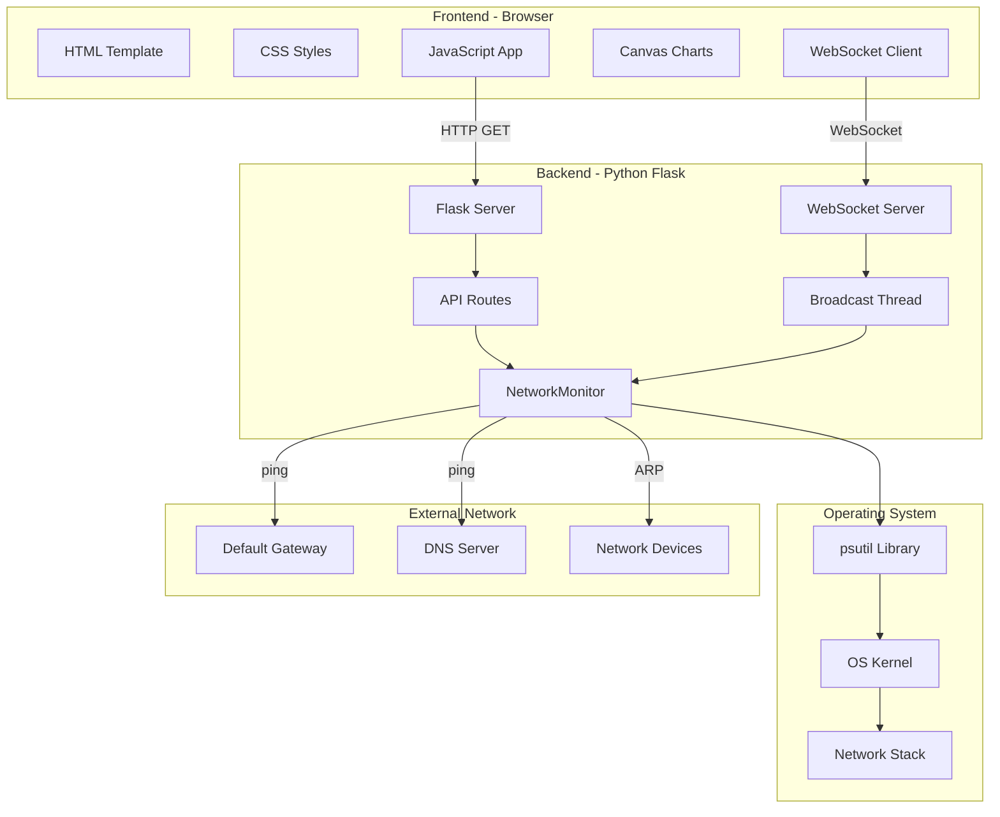
```mermaid
graph TB
    subgraph Frontend["Frontend - Browser"]
        HTML[HTML Template]
        CSS[CSS Styles]
        JS[JavaScript App]
        Canvas[Canvas Charts]
        WS_Client[WebSocket Client]
    end

    subgraph Backend["Backend - Python Flask"]
        Flask[Flask Server]
        Routes[API Routes]
        Monitor[NetworkMonitor]
        WS_Server[WebSocket Server]
        Broadcast[Broadcast Thread]
    end

    subgraph OS["Operating System"]
        psutil[psutil Library]
        Kernel[OS Kernel]
        Network[Network Stack]
    end

    subgraph External["External Network"]
        Gateway[Default Gateway]
        DNS[DNS Server]
        Devices[Network Devices]
    end

    JS -->|HTTP GET| Flask
    WS_Client -->|WebSocket| WS_Server
    Flask --> Routes
    Routes --> Monitor
    WS_Server --> Broadcast
    Broadcast --> Monitor
    Monitor --> psutil
    Monitor -->|ping| Gateway
    Monitor -->|ping| DNS
    Monitor -->|ARP| Devices
    psutil --> Kernel
    Kernel --> Network
```

---

## High-Level Architecture Diagram

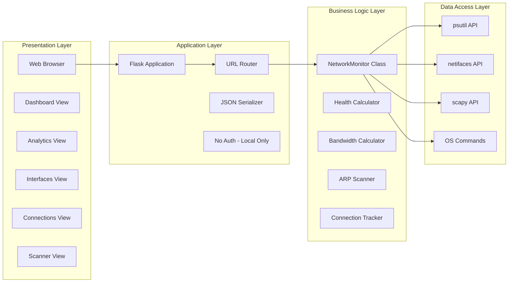
```mermaid
graph LR
    subgraph Presentation["Presentation Layer"]
        Browser[Web Browser]
        Dashboard[Dashboard View]
        Analytics[Analytics View]
        Interfaces[Interfaces View]
        Connections[Connections View]
        Scanner[Scanner View]
    end

    subgraph Application["Application Layer"]
        App[Flask Application]
        Router[URL Router]
        Serializer[JSON Serializer]
        Auth[No Auth - Local Only]
    end

    subgraph Business["Business Logic Layer"]
        NM[NetworkMonitor Class]
        Health[Health Calculator]
        Bandwidth[Bandwidth Calculator]
        Scanner2[ARP Scanner]
        ConnTrack[Connection Tracker]
    end

    subgraph Data["Data Access Layer"]
        psutil2[psutil API]
        netifaces2[netifaces API]
        scapy2[scapy API]
        OS_Cmds[OS Commands]
    end

    Browser --> App
    App --> Router
    Router --> NM
    NM --> psutil2
    NM --> netifaces2
    NM --> scapy2
    NM --> OS_Cmds
```

---

## Component Breakdown

### Backend Components

| Component | File | Responsibility |
|-----------|------|----------------|
| Flask App | app.py | HTTP server, routing, WebSocket |
| NetworkMonitor | network_monitor.py | All monitoring logic |
| Broadcast Thread | app.py (thread) | WebSocket data push |

### Frontend Components

| Component | File | Responsibility |
|-----------|------|----------------|
| HTML Template | index.html | Page structure, tab layout |
| CSS Styles | style.css | Visual design, responsive layout |
| JavaScript App | app.js | Data fetching, chart rendering, UI updates |

---

## Backend Architecture

### Flask Application Structure

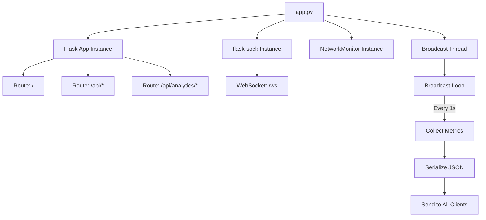
```mermaid
graph TD
    A[app.py] --> B[Flask App Instance]
    A --> C[flask-sock Instance]
    A --> D[NetworkMonitor Instance]
    A --> E[Broadcast Thread]

    B --> F[Route: /]
    B --> G[Route: /api/*]
    B --> H[Route: /api/analytics/*]

    C --> I[WebSocket: /ws]

    E --> J[Broadcast Loop]
    J -->|Every 1s| K[Collect Metrics]
    K --> L[Serialize JSON]
    L --> M[Send to All Clients]
```

### NetworkMonitor Class Diagram

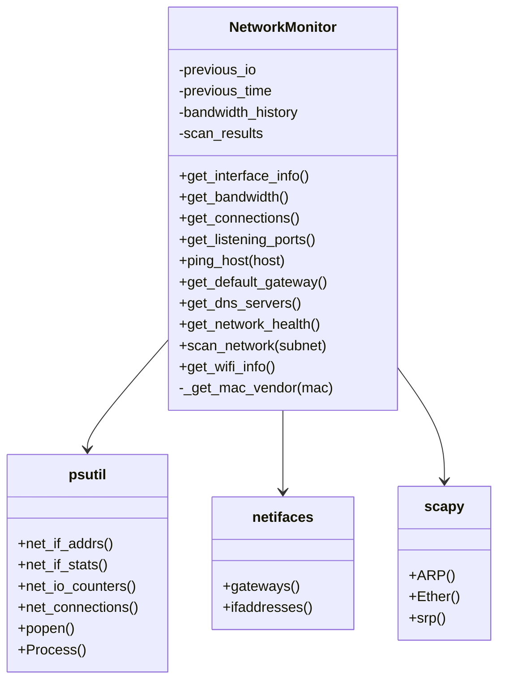
```mermaid
classDiagram
    class NetworkMonitor {
        -previous_io
        -previous_time
        -bandwidth_history
        -scan_results
        +get_interface_info()
        +get_bandwidth()
        +get_connections()
        +get_listening_ports()
        +ping_host(host)
        +get_default_gateway()
        +get_dns_servers()
        +get_network_health()
        +scan_network(subnet)
        +get_wifi_info()
        -_get_mac_vendor(mac)
    }

    class psutil {
        +net_if_addrs()
        +net_if_stats()
        +net_io_counters()
        +net_connections()
        +popen()
        +Process()
    }

    class netifaces {
        +gateways()
        +ifaddresses()
    }

    class scapy {
        +ARP()
        +Ether()
        +srp()
    }

    NetworkMonitor --> psutil
    NetworkMonitor --> netifaces
    NetworkMonitor --> scapy
```

### API Route Architecture

```mermaid
graph TD
    subgraph "API Endpoints"
        A[GET /] -->|Render| HTML[HTML Template]
        B[GET /api/interfaces] -->|JSON| IF[Interface Data]
        C[GET /api/bandwidth] -->|JSON| BW[Bandwidth Data]
        D[GET /api/connections] -->|JSON| CN[Connection Data]
        E[GET /api/listening] -->|JSON| LP[Listening Ports]
        F[GET /api/health] -->|JSON| HS[Health Score]
        G[GET /api/summary] -->|JSON| SM[Summary Data]
        H[POST /api/scan] -->|Trigger| SC[Scan Start]
        I[GET /api/scan/results] -->|JSON| SR[Scan Results]
        J[GET /api/ping] -->|JSON| PG[Ping Result]
        K[GET /api/dns] -->|JSON| DN[DNS Servers]
        L[GET /api/gateway] -->|JSON| GW[Gateway IP]
        M[GET /api/analytics/iface-bandwidth] -->|JSON| IB[Interface BW]
        N[GET /api/analytics/connections] -->|JSON| AC[Analytics Conn]
        O[GET /api/analytics/traffic-ratio] -->|JSON| TR[Traffic Ratio]
    end

    subgraph "WebSocket"
        P[/ws] -->|Bidirectional| WS[WebSocket Data]
    end
```

---

## Frontend Architecture

### JavaScript Module Structure

```mermaid
graph TD
    A[app.js] --> B[WebSocket Module]
    A --> C[Tab Navigation]
    A --> D[Chart Initialization]
    A --> E[Dashboard Functions]
    A --> F[Analytics Functions]
    A --> G[Ping Module]
    A --> H[Scanner Module]
    A --> I[Utility Functions]

    B --> B1[connectWebSocket]
    B --> B2[onmessage Handler]
    B --> B3[Reconnect Logic]

    C --> C1[initTabs]
    C --> C2[loadInterfaces]
    C --> C3[loadConnections]
    C --> C4[loadAnalytics]

    D --> D1[setupCanvas]
    D --> D2[initCharts]
    D --> D3[getCanvasSize]

    E --> E1[updateHealth]
    E --> E2[updateBandwidth]
    E --> E3[updateStats]
    E --> E4[updateBandwidthChart]
    E --> E5[updateErrorsChart]
    E --> E6[updatePacketsChart]
    E --> E7[updateInterfaceChart]
    E --> E8[updateConnectionStatusChart]
    E --> E9[drawDashboardTopPorts]

    F --> F1[drawIfaceBwChart]
    F --> F2[updateConnTrend]
    F --> F3[drawProtocolChart]
    F --> F4[drawTopPortsChart]
    F --> F5[drawRatioChart]
```

### Tab Navigation Architecture

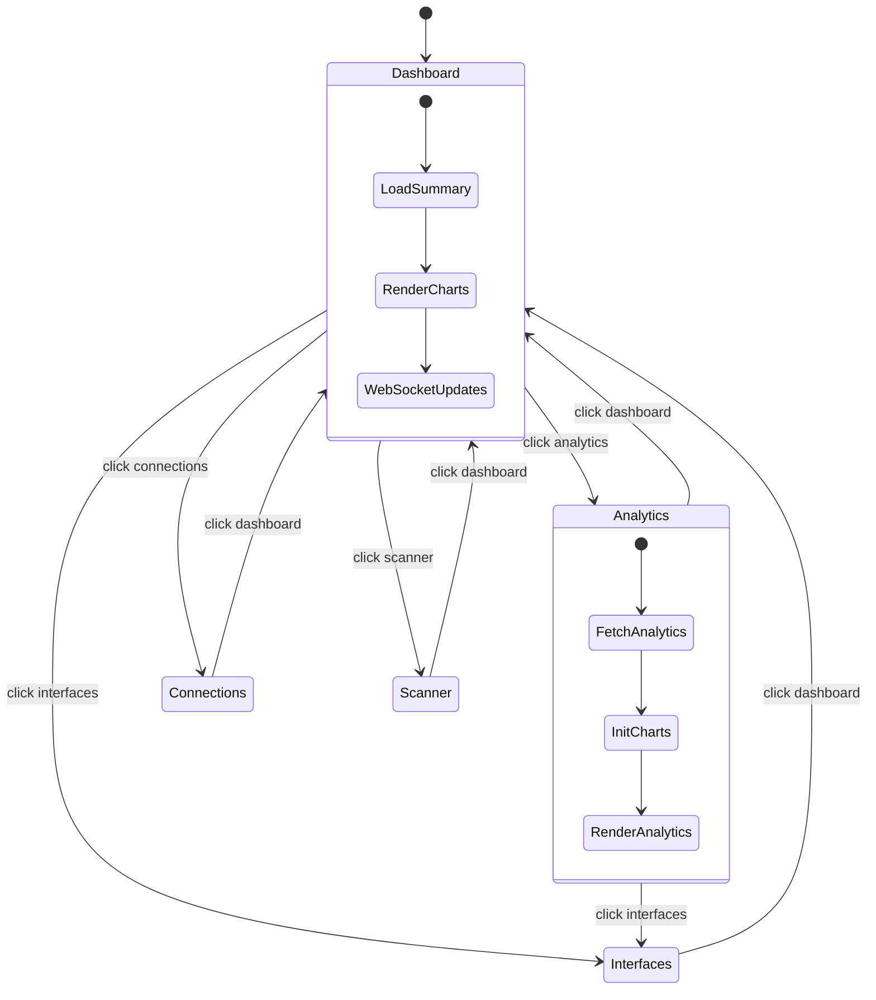
```mermaid
stateDiagram-v2
    [*] --> Dashboard
    Dashboard --> Analytics : click analytics
    Dashboard --> Interfaces : click interfaces
    Dashboard --> Connections : click connections
    Dashboard --> Scanner : click scanner
    Analytics --> Dashboard : click dashboard
    Analytics --> Interfaces : click interfaces
    Interfaces --> Dashboard : click dashboard
    Connections --> Dashboard : click dashboard
    Scanner --> Dashboard : click dashboard

    state Dashboard {
        [*] --> LoadSummary
        LoadSummary --> RenderCharts
        RenderCharts --> WebSocketUpdates
    }

    state Analytics {
        [*] --> FetchAnalytics
        FetchAnalytics --> InitCharts
        InitCharts --> RenderAnalytics
    }
```

---

## Data Flow Architecture

### Dashboard Data Flow

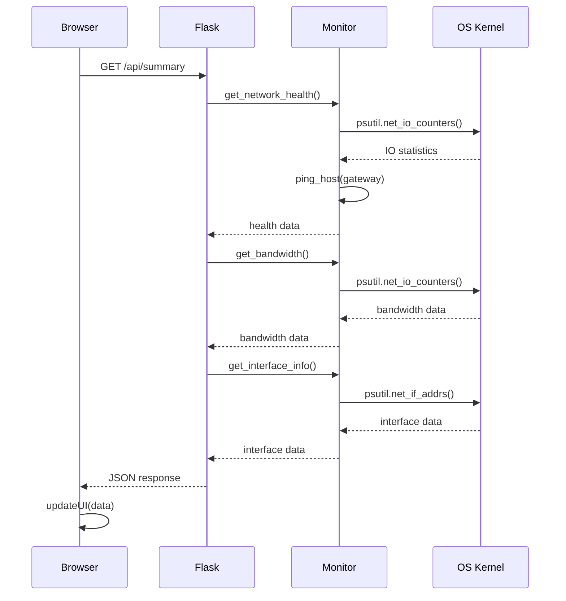
```mermaid
sequenceDiagram
    participant B as Browser
    participant F as Flask
    participant M as Monitor
    participant OS as OS Kernel

    B->>F: GET /api/summary
    F->>M: get_network_health()
    M->>OS: psutil.net_io_counters()
    OS-->>M: IO statistics
    M->>M: ping_host(gateway)
    M-->>F: health data
    F->>M: get_bandwidth()
    M->>OS: psutil.net_io_counters()
    OS-->>M: bandwidth data
    M-->>F: bandwidth data
    F->>M: get_interface_info()
    M->>OS: psutil.net_if_addrs()
    OS-->>M: interface data
    M-->>F: interface data
    F-->>B: JSON response
    B->>B: updateUI(data)
```

### WebSocket Data Flow

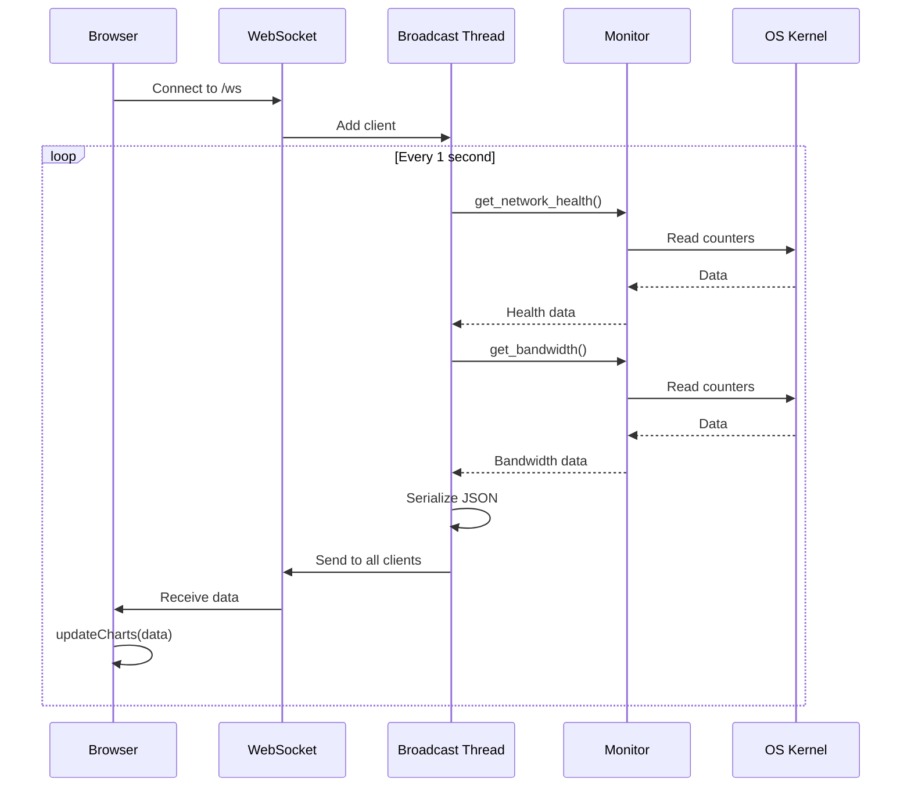
```mermaid
sequenceDiagram
    participant B as Browser
    participant WS as WebSocket
    participant T as Broadcast Thread
    participant M as Monitor
    participant OS as OS Kernel

    B->>WS: Connect to /ws
    WS->>T: Add client

    loop Every 1 second
        T->>M: get_network_health()
        M->>OS: Read counters
        OS-->>M: Data
        M-->>T: Health data
        T->>M: get_bandwidth()
        M->>OS: Read counters
        OS-->>M: Data
        M-->>T: Bandwidth data
        T->>T: Serialize JSON
        T->>WS: Send to all clients
        WS->>B: Receive data
        B->>B: updateCharts(data)
    end
```

### ARP Scan Data Flow

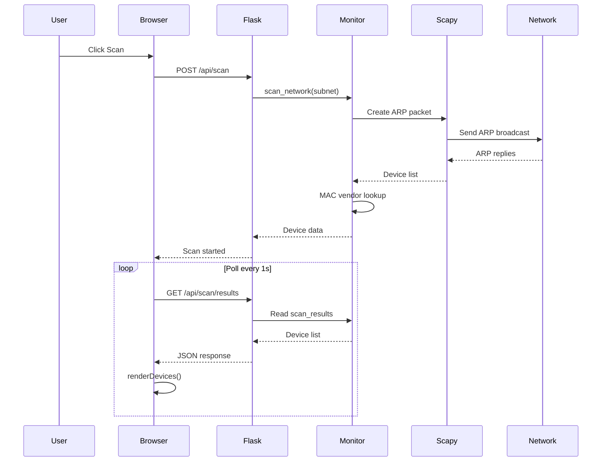
```mermaid
sequenceDiagram
    participant U as User
    participant B as Browser
    participant F as Flask
    participant M as Monitor
    participant S as Scapy
    participant N as Network

    U->>B: Click Scan
    B->>F: POST /api/scan
    F->>M: scan_network(subnet)
    M->>S: Create ARP packet
    S->>N: Send ARP broadcast
    N-->>S: ARP replies
    S-->>M: Device list
    M->>M: MAC vendor lookup
    M-->>F: Device data
    F-->>B: Scan started

    loop Poll every 1s
        B->>F: GET /api/scan/results
        F->>M: Read scan_results
        M-->>F: Device list
        F-->>B: JSON response
        B->>B: renderDevices()
    end
```

---

## WebSocket Architecture

### Connection Lifecycle

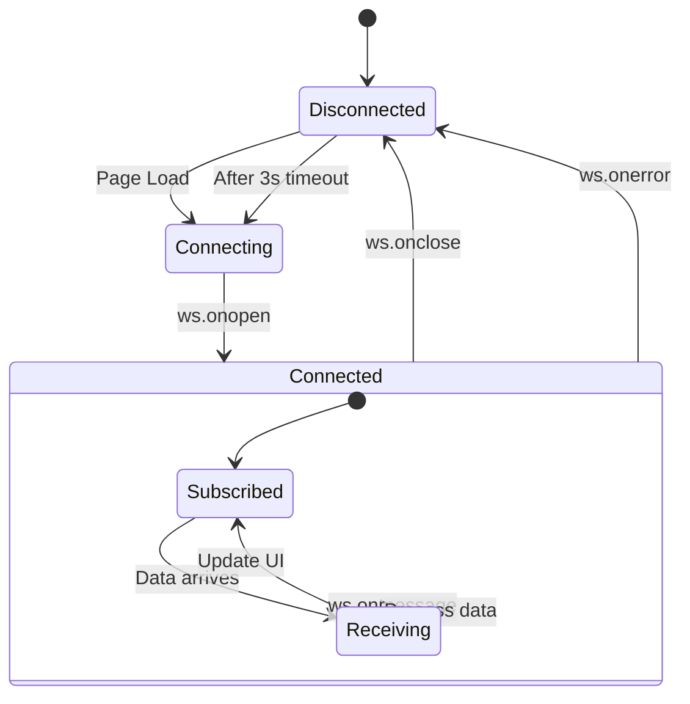
```mermaid
stateDiagram-v2
    [*] --> Disconnected
    Disconnected --> Connecting : Page Load
    Connecting --> Connected : ws.onopen
    Connected --> Disconnected : ws.onclose
    Disconnected --> Connecting : After 3s timeout
    Connected --> Disconnected : ws.onerror
    Connected --> Receiving : ws.onmessage
    Receiving --> Connected : Process data

    state Connected {
        [*] --> Subscribed
        Subscribed --> Receiving : Data arrives
        Receiving --> Subscribed : Update UI
    }
```

### Broadcast Thread Architecture

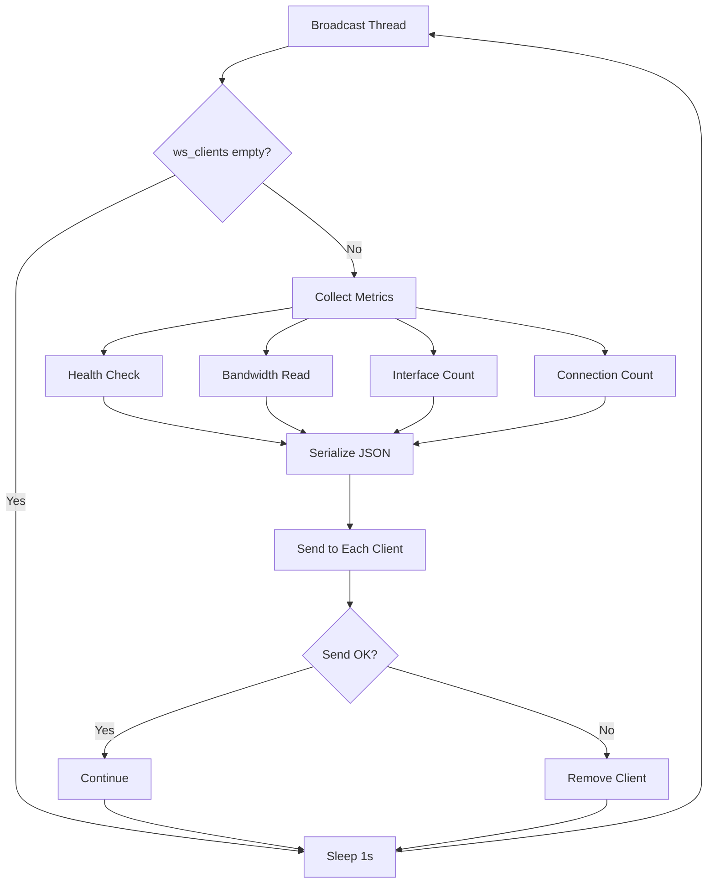
```mermaid
graph TD
    A[Broadcast Thread] --> B{ws_clients empty?}
    B -->|Yes| C[Sleep 1s]
    B -->|No| D[Collect Metrics]
    D --> E[Health Check]
    D --> F[Bandwidth Read]
    D --> G[Interface Count]
    D --> H[Connection Count]
    E --> I[Serialize JSON]
    F --> I
    G --> I
    H --> I
    I --> J[Send to Each Client]
    J --> K{Send OK?}
    K -->|Yes| L[Continue]
    K -->|No| M[Remove Client]
    L --> C
    M --> C
    C --> A
```

---

## Monitoring Module Architecture

### NetworkMonitor Method Categories

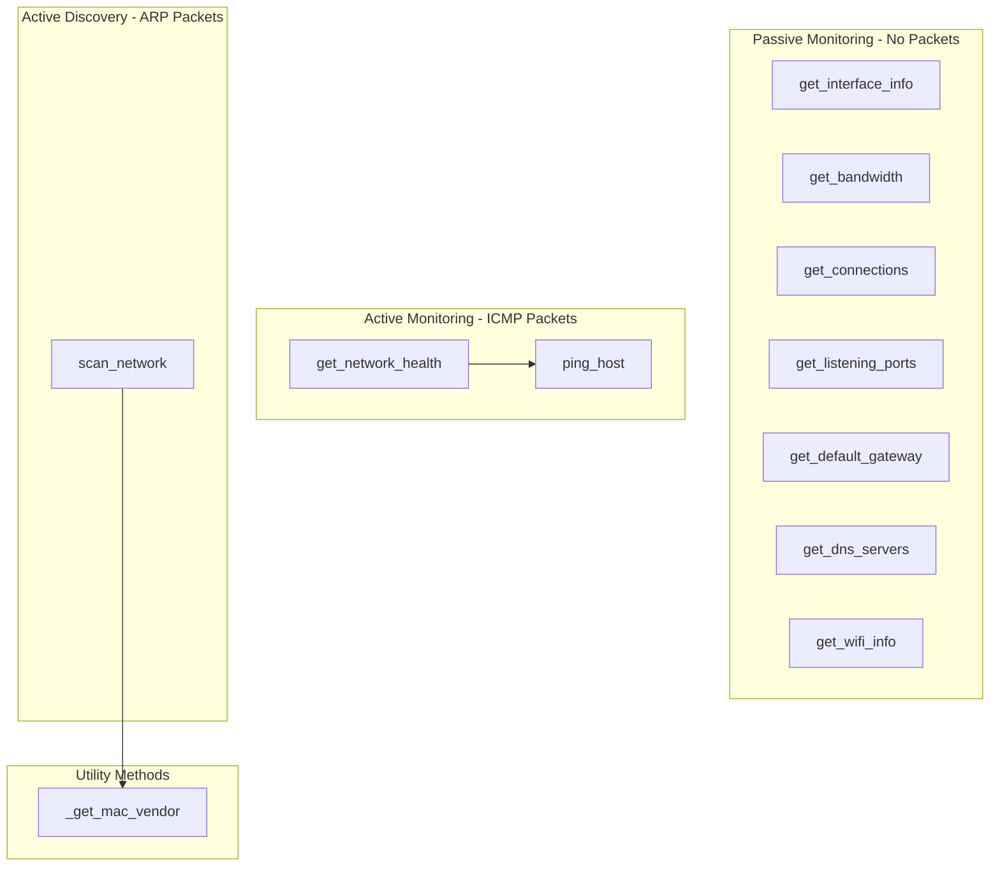
```mermaid
graph TD
    subgraph "Passive Monitoring - No Packets"
        A[get_interface_info]
        B[get_bandwidth]
        C[get_connections]
        D[get_listening_ports]
        E[get_default_gateway]
        F[get_dns_servers]
        G[get_wifi_info]
    end

    subgraph "Active Monitoring - ICMP Packets"
        H[ping_host]
        I[get_network_health]
    end

    subgraph "Active Discovery - ARP Packets"
        J[scan_network]
    end

    subgraph "Utility Methods"
        K[_get_mac_vendor]
    end

    I --> H
    J --> K
```

### Health Score Calculation Flow

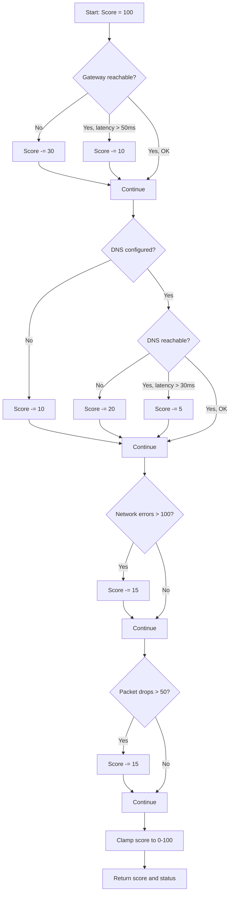
```mermaid
graph TD
    A[Start: Score = 100] --> B{Gateway reachable?}
    B -->|No| C[Score -= 30]
    B -->|Yes, latency > 50ms| D[Score -= 10]
    B -->|Yes, OK| E[Continue]
    C --> E
    D --> E
    E --> F{DNS configured?}
    F -->|No| G[Score -= 10]
    F -->|Yes| H{DNS reachable?}
    H -->|No| I[Score -= 20]
    H -->|Yes, latency > 30ms| J[Score -= 5]
    H -->|Yes, OK| K[Continue]
    G --> K
    I --> K
    J --> K
    K --> L{Network errors > 100?}
    L -->|Yes| M[Score -= 15]
    L -->|No| N[Continue]
    M --> N
    N --> O{Packet drops > 50?}
    O -->|Yes| P[Score -= 15]
    O -->|No| Q[Continue]
    P --> Q
    Q --> R[Clamp score to 0-100]
    R --> S[Return score and status]
```

### Bandwidth Calculation Flow

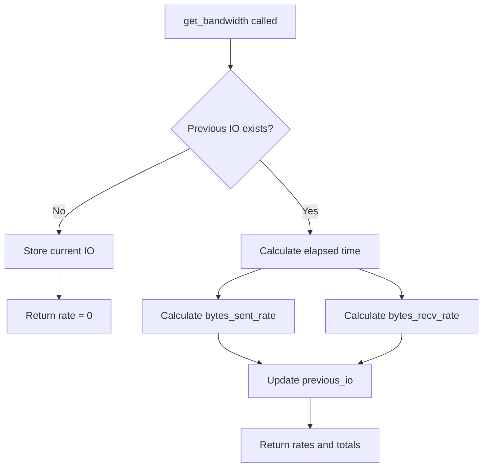
```mermaid
graph TD
    A[get_bandwidth called] --> B{Previous IO exists?}
    B -->|No| C[Store current IO]
    C --> D[Return rate = 0]
    B -->|Yes| E[Calculate elapsed time]
    E --> F[Calculate bytes_sent_rate]
    E --> G[Calculate bytes_recv_rate]
    F --> H[Update previous_io]
    G --> H
    H --> I[Return rates and totals]
```

---

## API Architecture

### Request Processing Pipeline

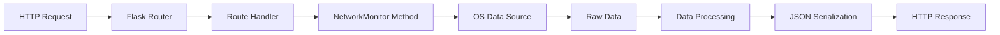
```mermaid
graph LR
    A[HTTP Request] --> B[Flask Router]
    B --> C[Route Handler]
    C --> D[NetworkMonitor Method]
    D --> E[OS Data Source]
    E --> F[Raw Data]
    F --> G[Data Processing]
    G --> H[JSON Serialization]
    H --> I[HTTP Response]
```

### Response Data Structure

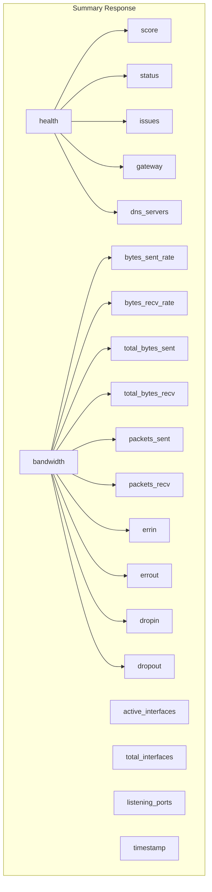
```mermaid
graph TD
    subgraph "Summary Response"
        A[health] --> A1[score]
        A --> A2[status]
        A --> A3[issues]
        A --> A4[gateway]
        A --> A5[dns_servers]
        B[bandwidth] --> B1[bytes_sent_rate]
        B --> B2[bytes_recv_rate]
        B --> B3[total_bytes_sent]
        B --> B4[total_bytes_recv]
        B --> B5[packets_sent]
        B --> B6[packets_recv]
        B --> B7[errin]
        B --> B8[errout]
        B --> B9[dropin]
        B --> B10[dropout]
        C[active_interfaces]
        D[total_interfaces]
        E[listening_ports]
        F[timestamp]
    end
```

---

## Chart Rendering Architecture

### Canvas Setup Flow

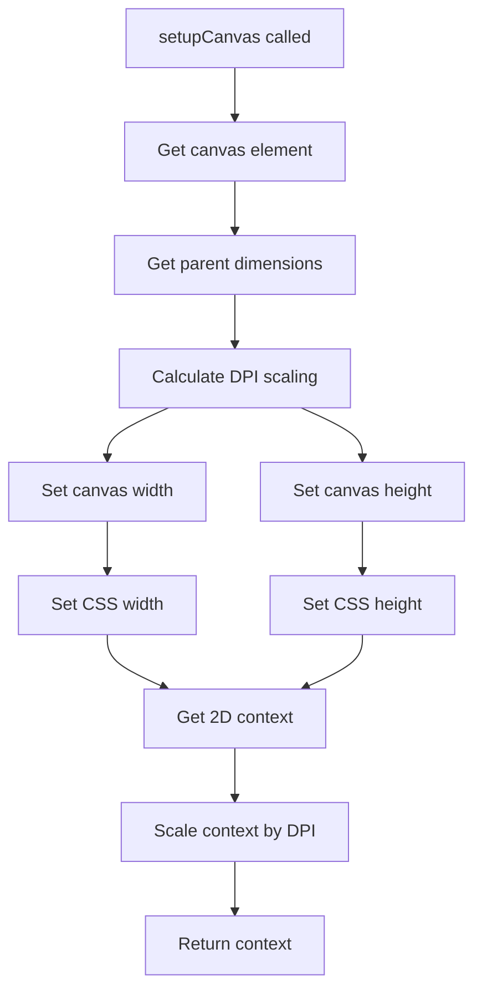
```mermaid
graph TD
    A[setupCanvas called] --> B[Get canvas element]
    B --> C[Get parent dimensions]
    C --> D[Calculate DPI scaling]
    D --> E[Set canvas width]
    D --> F[Set canvas height]
    E --> G[Set CSS width]
    F --> H[Set CSS height]
    G --> I[Get 2D context]
    H --> I
    I --> J[Scale context by DPI]
    J --> K[Return context]
```

### Chart Update Cycle

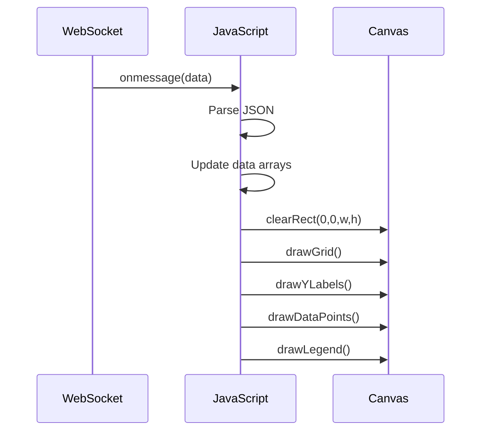
```mermaid
sequenceDiagram
    participant WS as WebSocket
    participant JS as JavaScript
    participant C as Canvas

    WS->>JS: onmessage(data)
    JS->>JS: Parse JSON
    JS->>JS: Update data arrays
    JS->>C: clearRect(0,0,w,h)
    JS->>C: drawGrid()
    JS->>C: drawYLabels()
    JS->>C: drawDataPoints()
    JS->>C: drawLegend()
```

---

## State Management

### Global State Variables

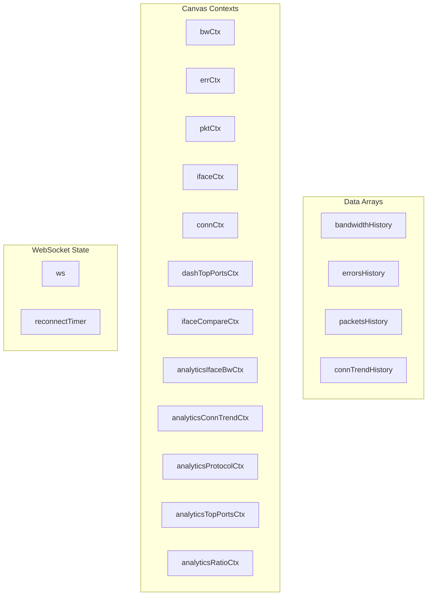
```mermaid
graph TD
    subgraph "Data Arrays"
        A[bandwidthHistory]
        B[errorsHistory]
        C[packetsHistory]
        D[connTrendHistory]
    end

    subgraph "Canvas Contexts"
        E[bwCtx]
        F[errCtx]
        G[pktCtx]
        H[ifaceCtx]
        I[connCtx]
        J[dashTopPortsCtx]
        K[ifaceCompareCtx]
        L[analyticsIfaceBwCtx]
        M[analyticsConnTrendCtx]
        N[analyticsProtocolCtx]
        O[analyticsTopPortsCtx]
        P[analyticsRatioCtx]
    end

    subgraph "WebSocket State"
        Q[ws]
        R[reconnectTimer]
    end
```

### Data Retention Policy

| Data Array | Max Points | Update Rate | Purpose |
|------------|------------|-------------|---------|
| bandwidthHistory | 60 | 1/sec | Bandwidth chart |
| errorsHistory | 60 | 1/sec | Errors chart |
| packetsHistory | 2 | 1/sec | Packets chart |
| connTrendHistory | 60 | 1/sec | Connection trend |

---

## Thread Architecture

### Thread Overview

```mermaid
graph TD
    A[Main Thread] --> B[Flask Server]
    A --> C[Broadcast Thread]
    A --> D[Scan Thread - on demand]

    B --> B1[HTTP Request Handling]
    B --> B2[WebSocket Handling]

    C --> C1[Data Collection Loop]
    C1 --> C2[Sleep 1s]

    D --> D1[ARP Scan Execution]
    D1 --> D2[Store Results]
```

### Thread Safety

The system uses the following thread safety mechanisms:

1. **Global scan_in_progress flag** - Prevents concurrent scans
2. **ws_clients list** - Modified with copy-on-write pattern
3. **scan_results** - Written by scan thread, read by HTTP handler
4. **No locks needed** - psutil reads are atomic at kernel level

---

## Error Handling Architecture

### Backend Error Handling

```mermaid
graph TD
    A[Method Call] --> B[Try Block]
    B --> C{Success?}
    C -->|Yes| D[Return Data]
    C -->|No| E[Catch Exception]
    E --> F[Log Error]
    F --> G[Return Default Value]

    subgraph "Default Values"
        H[get_bandwidth: rate = 0]
        I[get_connections: empty list]
        J[ping_host: status = error]
        K[scan_network: error message]
    end
```

### Frontend Error Handling

```mermaid
graph TD
    A[API Call] --> B[Try Block]
    B --> C{Response OK?}
    C -->|Yes| D[Parse JSON]
    C -->|No| E[Log Error]
    D --> F[Update UI]
    E --> G[Show Fallback]

    H[WebSocket] --> I[Try Block]
    I --> J{Connected?}
    J -->|Yes| K[Process Message]
    J -->|No| L[Reconnect Timer]
```

---

## File Structure

```mermaid
graph TD
    A[network_project/] --> B[app.py]
    A --> C[network_monitor.py]
    A --> D[requirements.txt]
    A --> E[templates/]
    A --> F[static/]
    A --> G[docs/]

    E --> E1[index.html]

    F --> F1[css/]
    F --> F2[js/]

    F1 --> F1a[style.css]

    F2 --> F2a[app.js]

    G --> G1[overview.md]
    G --> G2[architecture.md]
    G --> G3[backend.md]
    G --> G4[security.md]
```

---

## Deployment Architecture

### Local Development

```mermaid
graph LR
    A[Developer Machine] --> B[Python Process]
    B --> C[Flask on 0.0.0.0:5000]
    C --> D[Browser on localhost:5000]
```

### Network Deployment

```mermaid
graph TD
    A[Server Machine] --> B[Python Process]
    B --> C[Flask on 0.0.0.0:5000]
    C --> D[LAN Access]
    D --> E[Browser 1]
    D --> F[Browser 2]
    D --> G[Browser N]
```

### Single Machine Architecture

```mermaid
graph TB
    subgraph "Single Machine"
        A[Flask Server] --> B[OS Kernel]
        A --> C[WebSocket Clients]
        B --> D[Network Interface]
        D --> E[Local Network]
        D --> F[Internet]
    end
```

---

## Summary

NetMonitor uses a clean, layered architecture with clear separation of concerns:

- **Backend**: Flask handles HTTP and WebSocket, NetworkMonitor handles all
  monitoring logic
- **Frontend**: Vanilla JS handles data fetching, chart rendering, and UI updates
- **Data Flow**: Push via WebSocket for real-time, pull via REST for on-demand
- **Threading**: Main thread for Flask, daemon thread for WebSocket broadcast,
  on-demand thread for ARP scans
- **State**: Global arrays for chart history, canvas contexts for rendering

The architecture is designed for simplicity, low resource usage, and minimal
network impact while providing comprehensive network visibility.
