# NetMonitor - Backend Documentation

## Table of Contents

1. [Backend Overview](#backend-overview)
2. [Flask Application](#flask-application)
3. [Package: psutil](#package-psutil)
4. [Package: netifaces](#package-netifaces)
5. [Package: scapy](#package-scapy)
6. [Package: flask-sock](#package-flask-sock)
7. [NetworkMonitor Class](#networkmonitor-class)
8. [System Calls and OS Interaction](#system-calls-and-os-interaction)
9. [API Endpoints Reference](#api-endpoints-reference)
10. [WebSocket Implementation](#websocket-implementation)
11. [Threading Model](#threading-model)
11. [Data Structures](#data-structures)
12. [Error Handling](#error-handling)
13. [Platform-Specific Behavior](#platform-specific-behavior)
14. [Performance Considerations](#performance-considerations)

---

## Backend Overview

The backend is a Python application built on Flask that provides:

1. HTTP REST API for on-demand data retrieval
2. WebSocket for real-time data push
3. Network monitoring via system-level APIs
4. ARP network scanning via scapy

The backend runs as a single process with two threads:

- Main thread: Flask HTTP/WebSocket server
- Daemon thread: WebSocket broadcast loop

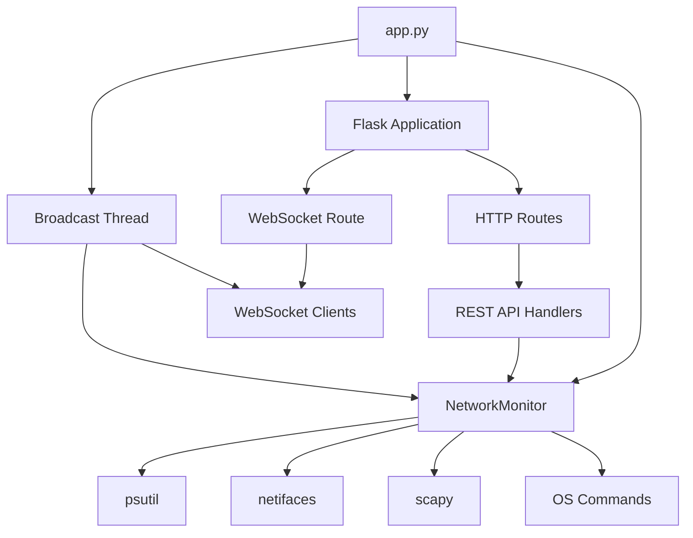

---

## Flask Application

### Initialization

```python
app = Flask(__name__)
CORS(app)
sock = Sock(app)
monitor = NetworkMonitor()
```

The Flask app is created with CORS enabled for cross-origin requests during
development. flask-sock is attached for WebSocket support. A single
NetworkMonitor instance is shared across all requests.

### Configuration

| Setting | Value | Purpose |
|---------|-------|---------|
| debug | True | Auto-reload on code changes |
| host | 0.0.0.0 | Listen on all interfaces |
| port | 5000 | Standard Flask port |

### Route Registration

All routes are registered via Flask decorators:

- `@app.route()` for HTTP endpoints
- `@sock.route()` for WebSocket endpoints

---

## Package: psutil

### Purpose

psutil (process and system utilities) is the primary package for reading
OS-level network statistics. It provides cross-platform access to system
information.

### Functions Used

#### psutil.net_if_addrs()

Returns a dictionary mapping interface names to their addresses.

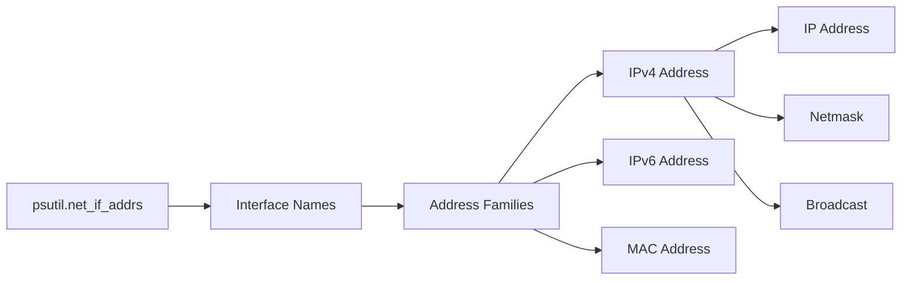

**Return Structure:**
```python
{
    "eth0": [
        snicaddr(family=2, address='192.168.1.100', netmask='255.255.255.0', broadcast='192.168.1.255'),
        snicaddr(family=17, address='aa:bb:cc:dd:ee:ff', netmask=None, broadcast='ff:ff:ff:ff:ff:ff')
    ],
    "lo": [
        snicaddr(family=2, address='127.0.0.1', netmask='255.0.0.0', broadcast=None)
    ]
}
```

**Used in:** `get_interface_info()`

#### psutil.net_if_stats()

Returns network interface statistics (up/down, speed, MTU).

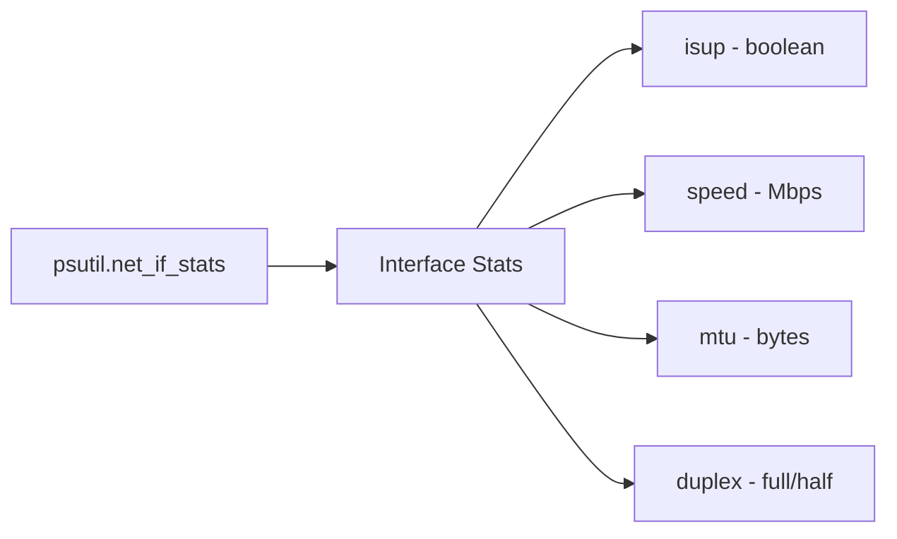

**Return Structure:**
```python
{
    "eth0": snicstats(isup=True, speed=1000, mtu=1500, duplex=nic_duplex_full),
    "lo": snicstats(isup=True, speed=0, mtu=65536, duplex=nic_duplex_full)
}
```

**Used in:** `get_interface_info()`

#### psutil.net_io_counters()

Returns network I/O statistics as counters.

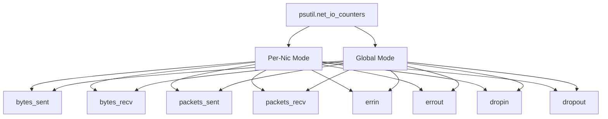

**Return Structure (global):**
```python
snetio(
    bytes_sent=123456789,
    bytes_recv=987654321,
    packets_sent=100000,
    packets_recv=200000,
    errin=10,
    errout=5,
    dropin=20,
    dropout=15
)
```

**Used in:** `get_bandwidth()`, `get_network_health()`

#### psutil.net_connections()

Returns all active network connections.

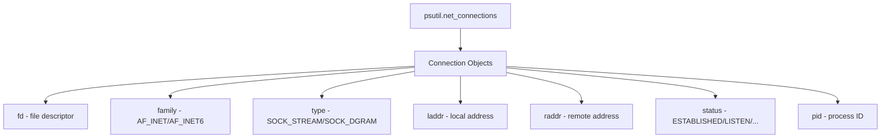

**Return Structure:**
```python
sconn(
    fd=3,
    family=2,
    type=1,
    laddr(addr='192.168.1.100', port=8080),
    raddr(addr='192.168.1.1', port=443),
    status='ESTABLISHED',
    pid=1234
)
```

**Used in:** `get_connections()`, `get_listening_ports()`

#### psutil.popen()

Executes a system command and returns output. Used for ping and ipconfig.


**Used in:** `ping_host()`, `get_dns_servers()`, `get_wifi_info()`

#### psutil.Process()

Gets process information by PID.

```mermaid
graph LR
    A[psutil.Process] --> B[PID Input]
    B --> C[Process Object]
    C --> D[name()]
    C --> E[exe()]
    C --> F[cmdline()]
```

**Used in:** `get_listening_ports()` (to get process name for each listening port)

---

## Package: netifaces

### Purpose

netifaces provides cross-platform access to network interface information,
particularly the default gateway and interface addresses.

### Functions Used

#### netifaces.gateways()

Returns a dictionary of network gateways.

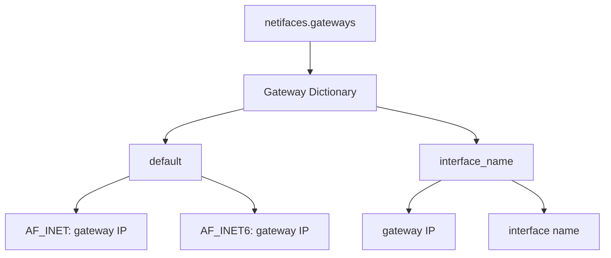

**Return Structure:**
```python
{
    'default': {
        2: ('192.168.1.1', 'eth0'),  # AF_INET
        10: ('fe80::1', 'eth0')      # AF_INET6
    },
    2: [
        ('192.168.1.1', 'eth0', True)
    ]
}
```

**Used in:** `get_default_gateway()`

#### netifaces.ifaddresses()

Returns addresses for a specific interface.

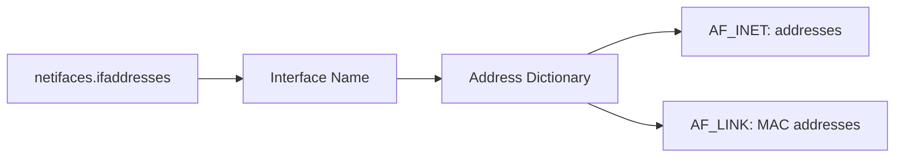

**Used in:** `scan_network()` (to auto-detect subnet)

---

## Package: scapy

### Purpose

scapy is used for ARP network scanning to discover devices on the local network.
It is optional - the system works without it.

### Functions Used

#### ARP()

Creates an ARP request packet.

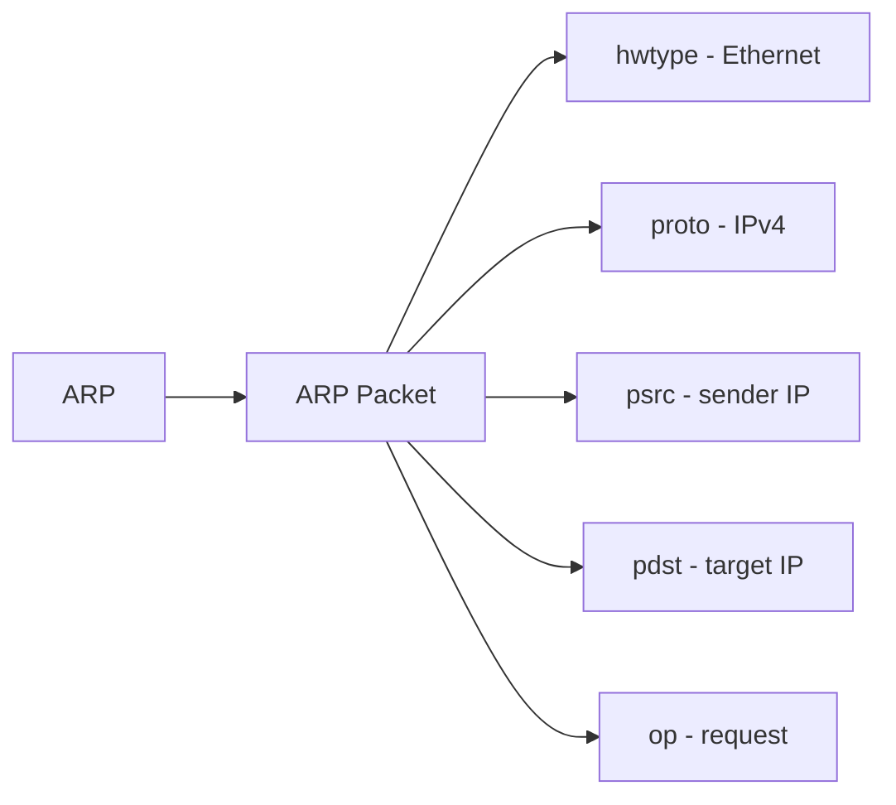

#### Ether()

Creates an Ethernet frame.

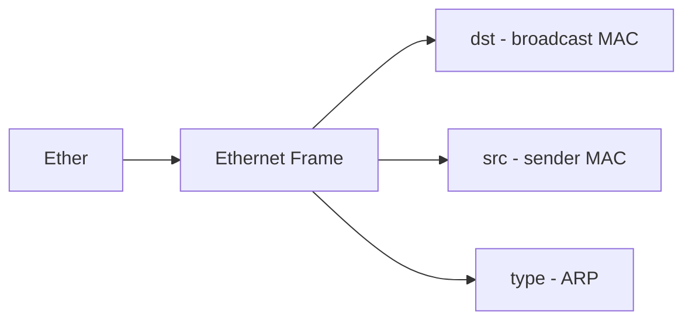

#### srp()

Sends and receives packets at layer 2.


**Parameters:**
- timeout: 3 seconds
- verbose: False (no console output)

**Used in:** `scan_network()`

### ARP Scan Process

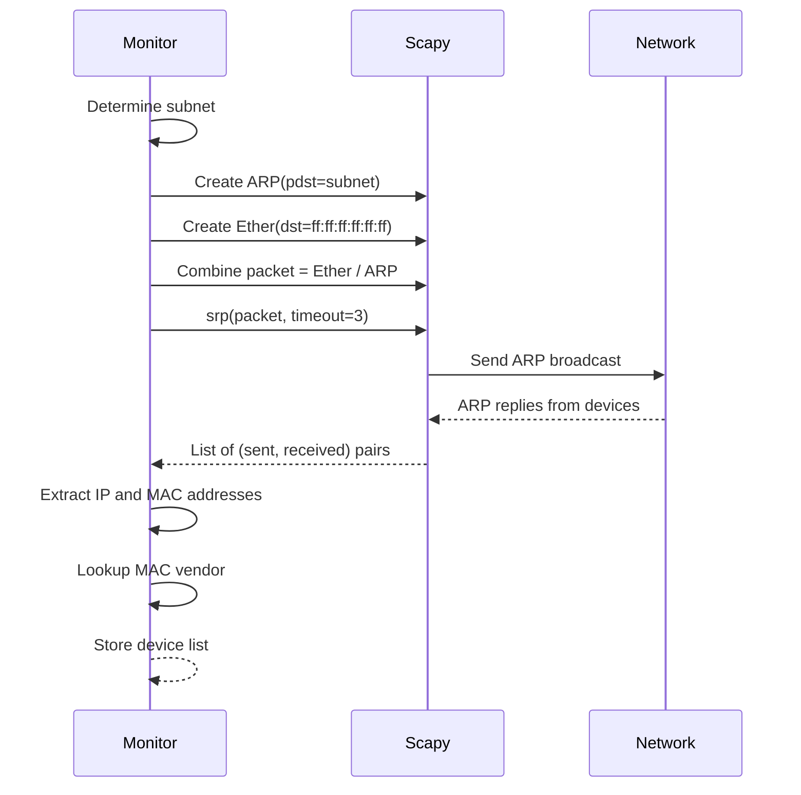

---

## Package: flask-sock

### Purpose

flask-sock provides WebSocket support for Flask. It is used for real-time
data push from server to browser.

### Implementation

```mermaid
graph TD
    A[flask-sock] --> B[Sock Instance]
    B --> C[@sock.route decorator]
    C --> D[WebSocket Handler]
    D --> E[ws.receive - read]
    D --> F[ws.send - write]
```

### WebSocket Handler

```python
@sock.route("/ws")
def websocket(ws):
    ws_clients.append(ws)
    try:
        while True:
            ws.receive()
    except Exception:
        pass
    finally:
        if ws in ws_clients:
            ws_clients.remove(ws)
```

The handler:
1. Adds the client to the ws_clients list
2. Enters a receive loop (keeps connection alive)
3. Removes the client on disconnect

---

## NetworkMonitor Class

### Initialization

```python
class NetworkMonitor:
    def __init__(self):
        self.previous_io = None      # Previous IO counters for rate calculation
        self.previous_time = None    # Previous timestamp for rate calculation
        self.bandwidth_history = []  # Historical bandwidth data
        self.ping_history = []       # Historical ping results
        self.dns_history = []        # Historical DNS results
        self.scan_results = []       # Last scan results
```

### Method Categories

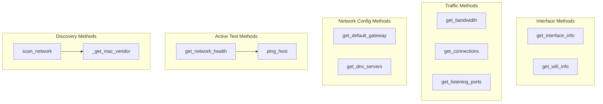

---

## System Calls and OS Interaction

### Windows Commands

| Command | Purpose | Used In |
|---------|---------|---------|
| `ping -n 1 -w 3000 <host>` | ICMP ping with 3s timeout | `ping_host()` |
| `ipconfig /all` | Get DNS servers | `get_dns_servers()` |
| `netsh wlan show interfaces` | Get WiFi info | `get_wifi_info()` |

### Linux Commands

| Command | Purpose | Used In |
|---------|---------|---------|
| `ping -c 1 -W 3 <host>` | ICMP ping with 3s timeout | `ping_host()` |
| `cat /etc/resolv.conf` | Get DNS servers | `get_dns_servers()` |

### psutil System Calls

| psutil Function | Underlying System Call | Purpose |
|-----------------|----------------------|---------|
| `net_if_addrs()` | `getifaddrs()` | Get interface addresses |
| `net_if_stats()` | `ioctl(SIOCGIFADDR)` | Get interface stats |
| `net_io_counters()` | `sysctl()` / `/proc/net/dev` | Get IO counters |
| `net_connections()` | `sock_diag` / `/proc/net/tcp` | Get connections |
| `popen()` | `fork()+exec()` | Run system commands |
| `Process()` | `open(/proc/PID)` | Get process info |

### Kernel Data Sources

```mermaid
graph TD
    A[psutil] --> B[/proc/net/dev - Linux]
    A --> C[/proc/net/tcp - Linux]
    A --> D[/proc/net/udp - Linux]
    A --> E[GetIfTable - Windows]
    A --> F[GetIpStatistics - Windows]

    B --> G[Interface counters]
    C --> H[TCP connections]
    D --> I[UDP connections]
    E --> J[Interface stats]
    F --> K[IO statistics]
```

---

## API Endpoints Reference

### GET /api/interfaces

Returns all network interface information.

**Response:**
```json
[
    {
        "name": "eth0",
        "addresses": [
            {"family": "AF_INET", "address": "192.168.1.100", "netmask": "255.255.255.0"}
        ],
        "is_up": true,
        "speed": 1000,
        "mtu": 1500,
        "bytes_sent": 123456789,
        "bytes_recv": 987654321
    }
]
```

### GET /api/bandwidth

Returns current bandwidth rates and totals.

**Response:**
```json
{
    "bytes_sent_rate": 1024,
    "bytes_recv_rate": 4096,
    "total_bytes_sent": 123456789,
    "total_bytes_recv": 987654321,
    "packets_sent": 100000,
    "packets_recv": 200000,
    "errin": 10,
    "errout": 5,
    "dropin": 20,
    "dropout": 15
}
```

### GET /api/connections

Returns all active network connections.

**Response:**
```json
[
    {
        "fd": 3,
        "family": "AddressFamily.AF_INET",
        "type": "SocketType.SOCK_STREAM",
        "laddr": "192.168.1.100:8080",
        "raddr": "192.168.1.1:443",
        "status": "ESTABLISHED",
        "pid": 1234
    }
]
```

### GET /api/health

Returns network health score and issues.

**Response:**
```json
{
    "score": 85,
    "status": "excellent",
    "issues": [],
    "gateway": "192.168.1.1",
    "dns_servers": ["8.8.8.8", "8.8.4.4"],
    "timestamp": "2026-05-28T10:30:00.000000"
}
```

### POST /api/scan

Triggers an ARP network scan.

**Request:**
```json
{
    "subnet": "192.168.1.0/24"
}
```

**Response:**
```json
{
    "message": "Scan started"
}
```

### GET /api/ping

Pings a host and returns the result.

**Parameters:**
- `host` (query): IP address or hostname

**Response:**
```json
{
    "host": "8.8.8.8",
    "latency": 12.5,
    "status": "up"
}
```

### GET /api/analytics/connections

Returns aggregated connection statistics.

**Response:**
```json
{
    "total": 45,
    "by_status": {"ESTABLISHED": 30, "LISTEN": 10, "TIME_WAIT": 5},
    "by_type": {"tcp": 35, "udp": 10},
    "top_ports": [
        {"port": "443", "count": 15},
        {"port": "80", "count": 10}
    ]
}
```

### GET /api/analytics/traffic-ratio

Returns total sent vs received bytes.

**Response:**
```json
{
    "sent": 123456789,
    "recv": 987654321
}
```

---

## WebSocket Implementation

### Broadcast Thread

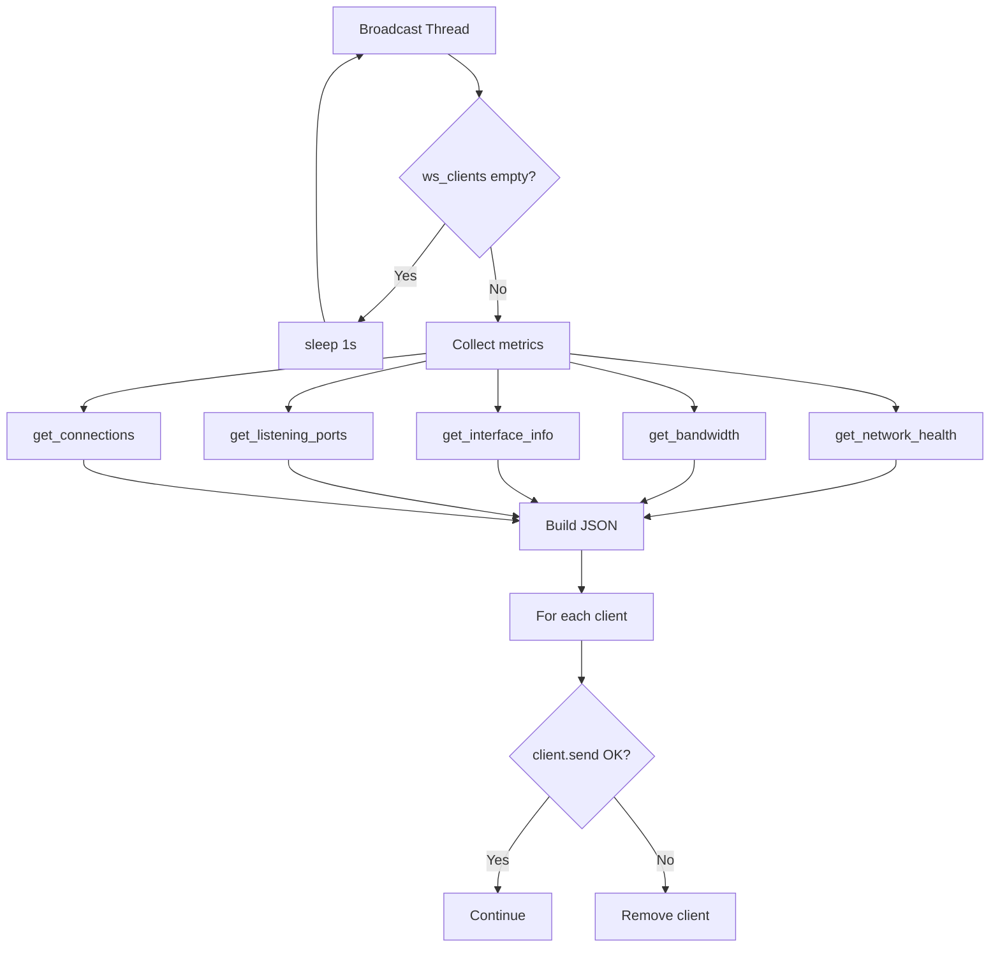

### Data Sent via WebSocket

```json
{
    "type": "update",
    "health": {...},
    "bandwidth": {...},
    "active_interfaces": 3,
    "total_interfaces": 5,
    "listening_ports": 12,
    "connection_count": 45,
    "timestamp": 1716892800.0
}
```

---

## Threading Model

### Thread Overview

| Thread | Type | Purpose | Lifetime |
|--------|------|---------|----------|
| Main | Main | Flask server | Application lifetime |
| Broadcast | Daemon | WebSocket push | Application lifetime |
| Scan | Daemon | ARP scan | Per-scan |

### Thread Safety

The system uses minimal synchronization:

1. **ws_clients list** - Modified via copy pattern (iteration on `ws_clients[:]`)
2. **scan_in_progress** - Boolean flag, race-tolerant
3. **scan_results** - Write-then-read pattern
4. **psutil calls** - Kernel-level atomic reads

No explicit locks or mutexes are used because:

- psutil reads are atomic at the kernel level
- WebSocket client list modifications are rare
- Scan results are overwritten atomically
- False positives from race conditions are harmless

---

## Data Structures

### NetworkMonitor State

```python
{
    "previous_io": snetio(...),      # Last IO counters snapshot
    "previous_time": float,          # Last timestamp
    "bandwidth_history": [...],      # Not actively used
    "ping_history": [...],           # Not actively used
    "dns_history": [...],            # Not actively used
    "scan_results": [...]            # Last ARP scan results
}
```

### Interface Info Object

```python
{
    "name": str,                     # Interface name
    "addresses": [                   # List of addresses
        {
            "family": str,           # Address family
            "address": str,          # IP or MAC address
            "netmask": str,          # Netmask (optional)
            "broadcast": str         # Broadcast address (optional)
        }
    ],
    "is_up": bool,                   # Interface status
    "speed": int,                    # Link speed in Mbps
    "mtu": int,                      # Maximum transmission unit
    "bytes_sent": int,               # Total bytes sent
    "bytes_recv": int                # Total bytes received
}
```

### Connection Object

```python
{
    "fd": int,                       # File descriptor
    "family": str,                   # Address family
    "type": str,                     # Socket type
    "laddr": str,                    # Local address (ip:port)
    "raddr": str,                    # Remote address (ip:port)
    "status": str,                   # Connection status
    "pid": int                       # Process ID
}
```

---

## Error Handling

### Strategy

The backend uses a fail-safe approach:

1. **Try-except blocks** around all OS interactions
2. **Default values** returned on failure
3. **No exceptions propagated** to frontend
4. **Silent logging** of errors

### Error Scenarios

| Scenario | Handling | Default Return |
|----------|----------|----------------|
| psutil unavailable | Import error caught | Empty data |
| Interface not found | KeyError caught | Default values |
| Process not found | NoSuchProcess caught | "unknown" |
| Ping fails | Exception caught | status: "error" |
| Scapy unavailable | ImportError caught | Error message |
| Netifaces unavailable | ImportError caught | None |
| Command fails | Exception caught | Empty result |

---

## Platform-Specific Behavior

### Windows

| Feature | Implementation |
|---------|---------------|
| Ping | `ping -n 1 -w 3000` |
| DNS | `ipconfig /all` parsing |
| WiFi | `netsh wlan show interfaces` |
| Gateway | netifaces library |
| Interface names | Format: "Ethernet", "Wi-Fi" |

### Linux

| Feature | Implementation |
|---------|---------------|
| Ping | `ping -c 1 -W 3` |
| DNS | `/etc/resolv.conf` parsing |
| WiFi | Not implemented |
| Gateway | netifaces library |
| Interface names | Format: "eth0", "wlan0" |

### macOS

| Feature | Implementation |
|---------|---------------|
| Ping | `ping -c 1 -W 3` |
| DNS | `/etc/resolv.conf` parsing |
| WiFi | Not implemented |
| Gateway | netifaces library |
| Interface names | Format: "en0", "en1" |

---

## Performance Considerations

### Backend Performance

| Operation | Frequency | CPU Impact | Network Impact |
|-----------|-----------|------------|----------------|
| psutil reads | 1/sec | Negligible | None |
| WebSocket broadcast | 1/sec | Low | ~1 KB/s |
| ARP scan | On-demand | Medium | Local broadcast |
| Health check pings | Per summary | Low | 2-4 ICMP packets |

### Memory Usage

- Flask server: ~20 MB
- NetworkMonitor: ~1 MB
- WebSocket clients: ~1 KB each
- Chart history arrays: ~50 KB total

### Scalability Limits

The system is designed for single-machine monitoring:

- **Max WebSocket clients**: ~50 (limited by broadcast thread)
- **Max connections tracked**: ~10,000 (limited by psutil)
- **Max interfaces**: ~20 (limited by OS)
- **Max scan devices**: ~254 (per /24 subnet)

---

## Summary

The backend is a lightweight, Python-based monitoring system that:

1. Uses psutil for all OS-level network statistics
2. Uses netifaces for gateway and interface detection
3. Uses scapy for optional ARP scanning
4. Uses flask-sock for WebSocket real-time updates
5. Generates only standard ICMP and ARP packets
6. Operates as a single process with minimal threading
7. Fails gracefully with default values on errors
8. Supports both Windows and Linux platforms
