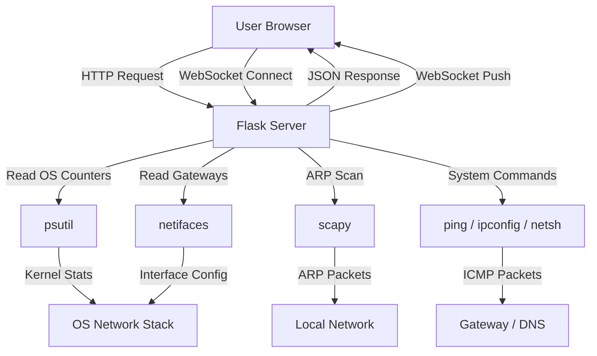

# NetMonitor - System Overview

## Table of Contents

1. [Introduction](#introduction)
2. [System Purpose](#system-purpose)
3. [Core Features](#core-features)
4. [Dashboard Tab](#dashboard-tab)
5. [Analytics Tab](#analytics-tab)
6. [Interfaces Tab](#interfaces-tab)
7. [Connections Tab](#connections-tab)
8. [Device Scanner Tab](#device-scanner-tab)
9. [Technology Stack](#technology-stack)
10. [Data Flow Overview](#data-flow-overview)
11. [User Interface Design](#user-interface-design)
12. [Real-Time Updates](#real-time-updates)
13. [Charts and Visualizations](#charts-and-visualizations)
14. [Usage Scenarios](#usage-scenarios)
15. [System Requirements](#system-requirements)

---

## Introduction

NetMonitor is a lightweight, real-time network health monitoring system built
with Python (Flask) on the backend and vanilla HTML/CSS/JavaScript on the
frontend. It provides a web-based dashboard that displays live network metrics,
interface statistics, active connections, and device discovery on the local
network.

The system is designed for network administrators, IT professionals, and
security-conscious users who need visibility into their network's health without
installing heavy enterprise monitoring suites.

---

## System Purpose

The primary goals of NetMonitor are:

1. **Real-time monitoring** - Display current network health with automatic
   updates every second via WebSocket
2. **Error detection** - Identify network errors, packet drops, and high latency
   conditions that could harm system or network performance
3. **Device discovery** - Scan the local network to find physically connected
   devices using ARP
4. **Connection visibility** - Show all active TCP/UDP connections, listening
   ports, and their associated processes
5. **Traffic analysis** - Track bandwidth usage, upload/download ratios, and
   per-interface traffic distribution

The system operates as a passive monitoring tool with minimal packet generation.
It reads OS kernel counters for most metrics and only generates standard
diagnostic packets (ICMP ping and ARP) when explicitly triggered.

---

## Core Features

### Network Health Scoring

The system computes a health score from 0 to 100 based on:

- Gateway reachability (ICMP ping)
- DNS server reachability (ICMP ping)
- Network error counts (from kernel counters)
- Packet drop counts (from kernel counters)

| Score Range | Status | Meaning |
|-------------|--------|---------|
| 80-100 | excellent | Network is fully operational |
| 60-79 | good | Minor issues detected |
| 40-59 | fair | Noticeable degradation |
| 0-39 | poor | Critical issues present |

### Real-Time Bandwidth Monitoring

Tracks bytes sent and received per second across all network interfaces. The
system calculates the delta between consecutive readings and divides by the
elapsed time to produce a rate in bytes per second.

### Device Discovery

Uses ARP (Address Resolution Protocol) requests to discover devices on the
local subnet. When a device responds, its IP address and MAC address are
captured. The MAC address prefix is matched against a vendor database to
identify the device manufacturer.

### Connection Tracking

Reads the OS socket table to display:

- All active TCP and UDP connections
- Connection states (ESTABLISHED, LISTEN, TIME_WAIT, etc.)
- Local and remote addresses with ports
- Process IDs associated with each connection

---

## Dashboard Tab

The dashboard is the default view and contains:

### Health Score Display

A circular progress indicator showing the current network health score. The
circle fills proportionally and changes color based on the score:

- Green for excellent (80-100)
- Yellow for good (60-79)
- Orange for fair (40-59)
- Red for poor (0-39)

### Statistics Grid

Four key metrics displayed in a grid:

1. **Upload Speed** - Current upload rate in bytes/second
2. **Download Speed** - Current download rate in bytes/second
3. **Open Ports** - Number of ports in LISTEN state
4. **Active Interfaces** - Count of up interfaces vs total interfaces

### Bandwidth Over Time Chart

A line chart showing upload and download speeds over the last 60 data points
(approximately 2 minutes at 2-second intervals). Download uses a solid blue
line, upload uses a dashed green line with dots.

### Errors Over Time Chart

A bar chart tracking network errors (red) and packet drops (orange) over time.
Each data point represents the cumulative error count at that moment.

### Packets Over Time Chart

A bar chart showing packet send and receive rates as delta values between
consecutive readings.

### Interface Traffic Chart

Horizontal bars comparing sent and received bytes across all active network
interfaces.

### Connection Status Distribution

A pie chart showing the distribution of connection states (ESTABLISHED, LISTEN,
TIME_WAIT, etc.) with a total count in the center.

### Top Ports by Connections

A horizontal bar chart showing the 8 ports with the most active connections.

### Quick Ping Test

A manual ping tool where the user can enter a host address and click "run" to
test connectivity. Displays the result with latency in milliseconds.

### All Listening Ports Table

A full table of all ports in LISTEN state, showing port number, bind address,
process name, and PID.

---

## Analytics Tab

The analytics tab provides deeper insights with 5 advanced charts:

### Bandwidth Per Interface

A grouped bar chart comparing sent (blue) and received (green) bytes for each
active network interface. Useful for identifying which interface handles the
most traffic.

### Connection Count Trend

A line chart tracking the total number of active connections over time. Updates
in real-time via WebSocket. Shows the current count as a label.

### Protocol Distribution

A pie chart showing the TCP vs UDP connection ratio with percentage and count
labels. The center displays the total connection count.

### Top Ports by Connections

A horizontal bar chart showing the ports with the most active connections, with
count labels at the end of each bar.

### Sent vs Received Ratio

A donut chart showing the overall upload vs download traffic ratio. The center
displays the send percentage. The legend shows absolute values in human-readable
format.

---

## Interfaces Tab

Displays detailed information about all network interfaces:

### Interface Traffic Comparison

A full-width grouped bar chart comparing sent and received bytes across all
active interfaces with value labels on top of each bar.

### Interface Cards

Each interface is displayed as a card showing:

- Interface name and status (UP/DOWN)
- Link speed in Mbps
- MTU (Maximum Transmission Unit)
- Total bytes sent and received
- IPv4 address and netmask

---

## Connections Tab

A full table of all active network connections showing:

- Local address (IP:port)
- Remote address (IP:port)
- Connection status (with color-coded badges)
- Protocol type (TCP/UDP)
- Process ID

Connection status badges use different border colors:

- Green for ESTABLISHED
- Black for LISTEN
- Yellow for TIME_WAIT
- Red for CLOSE_WAIT
- Gray for other states

---

## Device Scanner Tab

Network device discovery tool:

### Controls

- Subnet input field (auto-detects if left empty)
- Scan button to initiate discovery
- Status indicator showing scan progress

### Results

Discovered devices are displayed as cards showing:

- Device IP address
- MAC address
- Vendor/manufacturer (from MAC prefix lookup)

The scanner uses ARP requests to discover devices. This requires:
- Scapy Python package installed
- Root/admin privileges on some systems

---

## Technology Stack

| Layer | Technology | Purpose |
|-------|------------|---------|
| Backend | Python 3.x | Server-side logic |
| Web Framework | Flask 3.0.0 | HTTP server and routing |
| WebSocket | flask-sock 0.7.0 | Real-time data push |
| System Monitoring | psutil 5.9.8 | OS-level network stats |
| ARP Scanning | scapy 2.5.0 | Device discovery |
| Interface Info | netifaces 0.11.0 | Network interface details |
| Frontend | HTML5 | Page structure |
| Styling | CSS3 | Retro minimal design |
| Charts | Canvas API | All chart rendering |
| Real-Time | WebSocket | Live data updates |

---

## Data Flow Overview

### Request-Response Cycle

1. Browser sends HTTP GET to an API endpoint
2. Flask routes the request to the appropriate handler
3. Handler calls NetworkMonitor method
4. NetworkMonitor reads data from OS via psutil
5. Data is serialized to JSON and returned
6. Browser receives JSON and updates the UI

### WebSocket Push Cycle

1. Browser establishes WebSocket connection to `/ws`
2. Server-side broadcast thread wakes every 1 second
3. Thread collects current metrics from NetworkMonitor
4. Data is serialized to JSON and sent to all connected clients
5. Browser receives JSON and updates charts in real-time

---

## User Interface Design

The frontend uses a retro minimal white design with:

### Typography

- Primary font: IBM Plex Mono (monospace)
- All labels in lowercase with letter-spacing
- Snake_case naming for section headers

### Color Scheme

| Element | Color | Hex |
|---------|-------|-----|
| Background | White | #f5f5f5 |
| Card Background | Pure White | #ffffff |
| Primary Text | Black | #000000 |
| Muted Text | Dark Gray | #333333 |
| Download | Blue | #0055cc |
| Upload | Green | #1a8a3a |
| Errors | Red | #991111 |
| Drops | Orange | #cc6600 |
| Borders | Black | #000000 |

### Layout

- Sticky navigation bar with tab buttons
- Grid-based card layout
- Responsive design for mobile devices
- Charts fill their parent containers

---

## Real-Time Updates

The system uses two mechanisms for data updates:

### WebSocket (Primary)

- Connects to `ws://host:5000/ws` or `wss://host:5000/ws`
- Server pushes data every 1 second
- Updates: health score, bandwidth, charts
- Auto-reconnects on disconnect (3-second delay)

### HTTP Polling (Fallback)

- Used for data not covered by WebSocket
- Dashboard: every 5 seconds
- Analytics: on-demand when tab opens
- Connections: on-demand when tab opens
- Device scanner: every 1 second during scan

---

## Charts and Visualizations

All charts are rendered using the HTML5 Canvas API. No external charting
libraries are used.

### Chart Types

| Chart | Type | Data Source |
|-------|------|-------------|
| Bandwidth Over Time | Line (dual) | WebSocket |
| Errors Over Time | Bar (dual) | WebSocket |
| Packets Over Time | Bar (dual) | WebSocket |
| Interface Traffic | Horizontal Bar | API |
| Connection Status | Pie | API |
| Top Ports | Horizontal Bar | API |
| Bandwidth Per Interface | Grouped Bar | API |
| Connection Trend | Line | WebSocket |
| Protocol Distribution | Pie | API |
| Traffic Ratio | Donut | API |

### Canvas Rendering

Each chart uses a dedicated canvas element with:

- High-DPI support via devicePixelRatio
- Proper scaling on window resize
- Grid lines for reference
- Y-axis labels with auto-scaling
- Legends with color indicators

---

## Usage Scenarios

### Network Administrators

- Monitor network health across infrastructure
- Detect connectivity issues early
- Track bandwidth usage patterns
- Identify unauthorized devices on the network

### IT Support

- Quick connectivity testing via ping tool
- Identify which processes use specific ports
- Verify DNS and gateway reachability
- Troubleshoot network performance issues

### Security Analysts

- Monitor for unusual connection patterns
- Track listening ports for unauthorized services
- Discover devices on the network
- Identify high error rates that could indicate attacks

### Home Users

- Monitor home network health
- See which devices are connected
- Track internet speed usage
- Verify router and DNS functionality

---

## System Requirements

### Minimum Requirements

- Python 3.7 or higher
- 256 MB RAM
- 100 MB disk space
- Network interface (wired or wireless)
- Modern web browser (Chrome, Firefox, Edge)

### Optional Requirements

- Scapy (for device scanning)
- Netifaces (for gateway/interface detection)
- Root/admin privileges (for ARP scanning)

### Supported Platforms

- Windows 10/11
- Linux (Ubuntu, Debian, Fedora, CentOS)
- macOS (with minor command differences)

---

## Performance Considerations

### Backend

- WebSocket broadcast thread uses 1-second intervals
- psutil calls are lightweight kernel reads
- ARP scan uses 3-second timeout
- No database required (all data is real-time)

### Frontend

- Charts update at WebSocket receive rate (1/sec)
- Maximum 60 data points per chart (rolling window)
- Canvas rendering is hardware-accelerated
- Responsive design adapts to screen size

### Network Impact

- WebSocket: ~1 KB/s data push to connected clients
- Health check pings: 2-4 ICMP packets per summary request
- ARP scan: ~254 ARP requests per /24 subnet (on-demand only)
- No background network traffic when idle

---

## Summary

NetMonitor provides a comprehensive, real-time view of network health through
a clean, minimal web interface. It combines passive OS monitoring with optional
active diagnostics to give users full visibility into their network's status,
performance, and connected devices.
