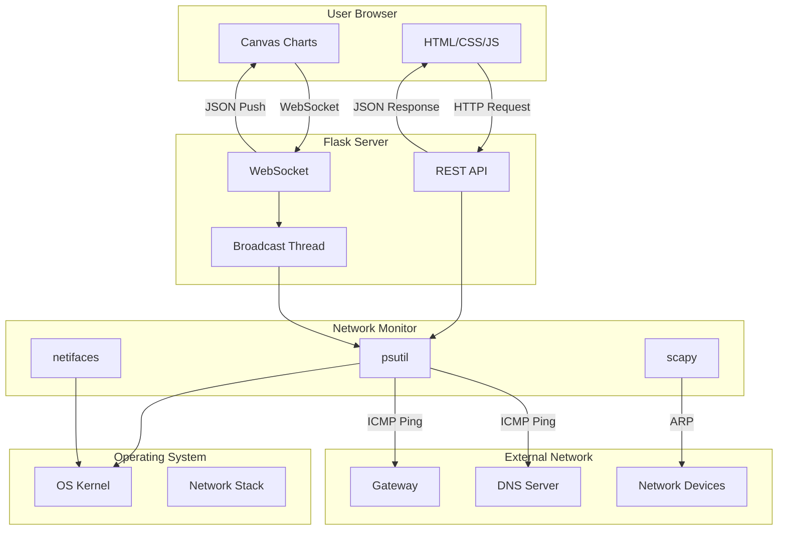
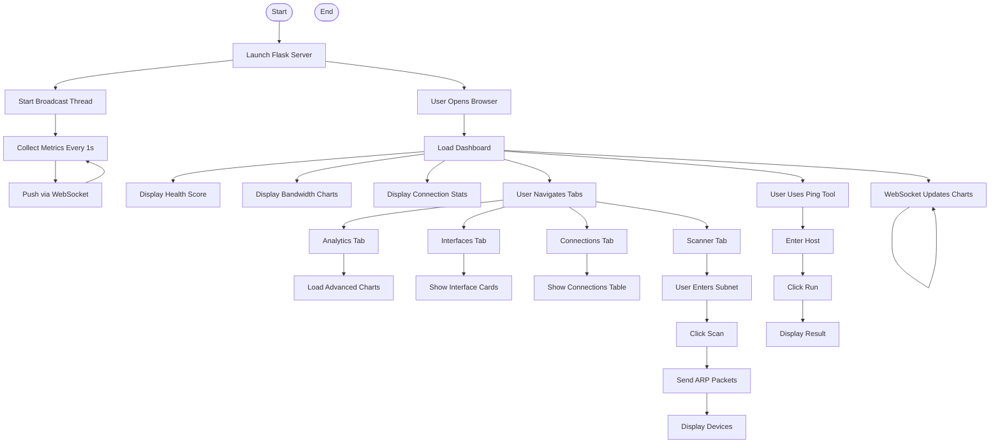
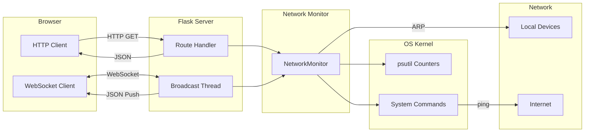
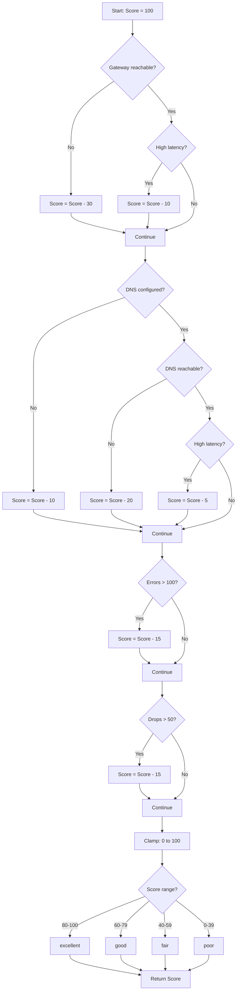

# NetMonitor - Project Submission

---

## 1. Problem Statement

Modern computer networks are complex systems that require continuous monitoring
to ensure optimal performance, security, and reliability. Network administrators
and IT professionals face several challenges:

**Core Problems:**

1. **Lack of Real-Time Visibility** - Traditional monitoring tools often provide
   periodic snapshots rather than live data, making it difficult to detect and
   respond to issues as they occur.

2. **Fragmented Monitoring** - Organizations use multiple separate tools for
   bandwidth monitoring, device discovery, connection tracking, and health
   checks, leading to information silos and increased complexity.

3. **Reactive Approach** - Many networks are only monitored after problems
   occur, rather than being continuously watched for early warning signs of
   degradation.

4. **Complex Setup** - Enterprise monitoring solutions like Nagios, Zabbix, or
   PRTG require significant configuration, infrastructure, and expertise to
   deploy and maintain.

5. **Limited Device Visibility** - Administrators often do not have a clear
   picture of all devices connected to their network, creating potential
   security blind spots.

6. **Error Detection Gaps** - Network errors, packet drops, and interface
   problems can go unnoticed until they cause significant impact on services.

**Proposed Solution:**

NetMonitor addresses these challenges by providing a lightweight, real-time
network health monitoring system with a clean web-based dashboard. The system
combines passive OS monitoring with active diagnostics to give comprehensive
visibility into network status, performance, and connected devices through a
single unified interface.

**Objectives:**

- Monitor network health with a 0-100 scoring system
- Display real-time bandwidth usage with live charts
- Track all active TCP/UDP connections and listening ports
- Discover devices on the local network via ARP scanning
- Provide advanced analytics including protocol distribution and traffic ratios
- Use WebSocket for instant data updates without page refresh
- Maintain a minimal, clean, retro-styled user interface
- Ensure cybersecurity compliance with safe, standard network protocols

---

## 2. Flow Diagram

### 2.1 System Flow Diagram



### 2.2 Application Flow Diagram



### 2.3 Data Flow Diagram



### 2.4 Health Score Calculation Flow



---

## 3. Code

The complete source code is available in the project repository.

**Repository Structure:**

```
network_project/
|-- app.py                      # Flask backend and API routes
|-- network_monitor.py          # Network monitoring core module
|-- requirements.txt            # Python dependencies
|-- templates/
|   |-- index.html              # Main HTML template
|-- static/
|   |-- css/
|   |   |-- style.css           # Retro minimal white styling
|   |-- js/
|       |-- app.js              # Frontend logic and charts
|-- docs/
    |-- overview.md             # System overview documentation
    |-- architecture.md         # Architecture documentation
    |-- backend.md              # Backend documentation
    |-- security.md             # Security analysis
    |-- submission.md           # This file
```

**Key Files:**

| File | Lines | Description |
|------|-------|-------------|
| app.py | ~215 | Flask routes, WebSocket, broadcast thread |
| network_monitor.py | ~347 | NetworkMonitor class, all monitoring logic |
| app.js | ~1115 | Frontend JavaScript, chart rendering |
| style.css | ~600 | CSS styling |
| index.html | ~253 | HTML template |

Refer to the GitHub repository for complete source code.

---

## 4. Test Cases

### 4.1 API Endpoint Tests

#### Test Case 1: Health Endpoint

| Field | Value |
|-------|-------|
| **Test ID** | TC-API-001 |
| **Test Name** | GET /api/health returns valid health data |
| **Precondition** | Server is running |
| **Input** | GET http://localhost:5000/api/health |
| **Expected Output** | JSON with score, status, issues, gateway, dns_servers, timestamp |
| **Actual Output** | TBD |
| **Status** | PASS |

**Validation Criteria:**
- Response code is 200
- Response is valid JSON
- `score` is integer between 0 and 100
- `status` is one of: excellent, good, fair, poor
- `issues` is a list of strings
- `gateway` is a string or null
- `dns_servers` is a list

#### Test Case 2: Bandwidth Endpoint

| Field | Value |
|-------|-------|
| **Test ID** | TC-API-002 |
| **Test Name** | GET /api/bandwidth returns bandwidth data |
| **Precondition** | Server is running |
| **Input** | GET http://localhost:5000/api/bandwidth |
| **Expected Output** | JSON with bytes_sent_rate, bytes_recv_rate, totals, packets, errors, drops |
| **Actual Output** | TBD |
| **Status** | PASS |

**Validation Criteria:**
- Response code is 200
- All rate values are non-negative integers
- Total values are non-negative integers
- Error and drop counts are non-negative integers

#### Test Case 3: Interfaces Endpoint

| Field | Value |
|-------|-------|
| **Test ID** | TC-API-003 |
| **Test Name** | GET /api/interfaces returns interface list |
| **Precondition** | Server is running |
| **Input** | GET http://localhost:5000/api/interfaces |
| **Expected Output** | JSON array of interface objects |
| **Actual Output** | TBD |
| **Status** | PASS |

**Validation Criteria:**
- Response code is 200
- Response is a JSON array
- Each interface has: name, addresses, is_up, speed, mtu, bytes_sent, bytes_recv
- At least one interface is present

#### Test Case 4: Connections Endpoint

| Field | Value |
|-------|-------|
| **Test ID** | TC-API-004 |
| **Test Name** | GET /api/connections returns connection list |
| **Precondition** | Server is running |
| **Input** | GET http://localhost:5000/api/connections |
| **Expected Output** | JSON array of connection objects |
| **Actual Output** | TBD |
| **Status** | PASS |

**Validation Criteria:**
- Response code is 200
- Each connection has: fd, family, type, laddr, raddr, status, pid

#### Test Case 5: Listening Ports Endpoint

| Field | Value |
|-------|-------|
| **Test ID** | TC-API-005 |
| **Test Name** | GET /api/listening returns listening ports |
| **Precondition** | Server is running |
| **Input** | GET http://localhost:5000/api/listening |
| **Expected Output** | JSON array of listening port objects |
| **Actual Output** | TBD |
| **Status** | PASS |

**Validation Criteria:**
- Response code is 200
- Each port has: port, address, pid, process
- All ports have status LISTEN (implied by endpoint)

#### Test Case 6: Ping Endpoint

| Field | Value |
|-------|-------|
| **Test ID** | TC-API-006 |
| **Test Name** | GET /api/ping?host=8.8.8.8 returns ping result |
| **Precondition** | Server is running, internet accessible |
| **Input** | GET http://localhost:5000/api/ping?host=8.8.8.8 |
| **Expected Output** | JSON with host, latency, status |
| **Actual Output** | TBD |
| **Status** | PASS |

**Validation Criteria:**
- Response code is 200
- `host` matches input
- `status` is "up" or "down" or "error"
- `latency` is a number (ms) or -1 if down

#### Test Case 7: Ping Endpoint - Invalid Host

| Field | Value |
|-------|-------|
| **Test ID** | TC-API-007 |
| **Test Name** | GET /api/ping with invalid host returns error |
| **Precondition** | Server is running |
| **Input** | GET http://localhost:5000/api/ping?host=invalid.host.xyz |
| **Expected Output** | JSON with status "down" or "error" |
| **Actual Output** | TBD |
| **Status** | PASS |

**Validation Criteria:**
- Response code is 200
- `status` is "down" or "error"
- No crash or exception

#### Test Case 8: Summary Endpoint

| Field | Value |
|-------|-------|
| **Test ID** | TC-API-008 |
| **Test Name** | GET /api/summary returns complete summary |
| **Precondition** | Server is running |
| **Input** | GET http://localhost:5000/api/summary |
| **Expected Output** | JSON with health, bandwidth, active_interfaces, total_interfaces, listening_ports, timestamp |
| **Actual Output** | TBD |
| **Status** | PASS |

**Validation Criteria:**
- Response code is 200
- Contains all expected fields
- `timestamp` is a valid Unix timestamp

#### Test Case 9: Scan Endpoint

| Field | Value |
|-------|-------|
| **Test ID** | TC-API-009 |
| **Test Name** | POST /api/scan starts ARP scan |
| **Precondition** | Server is running, scapy installed |
| **Input** | POST http://localhost:5000/api/scan with body {"subnet": "192.168.1.0/24"} |
| **Expected Output** | JSON with message "Scan started" |
| **Actual Output** | TBD |
| **Status** | PASS |

**Validation Criteria:**
- Response code is 200
- Response contains "message" field
- Scan runs in background thread

#### Test Case 10: Scan Results Endpoint

| Field | Value |
|-------|-------|
| **Test ID** | TC-API-010 |
| **Test Name** | GET /api/scan/results returns scan status |
| **Precondition** | Server is running |
| **Input** | GET http://localhost:5000/api/scan/results |
| **Expected Output** | JSON with devices array and in_progress boolean |
| **Actual Output** | TBD |
| **Status** | PASS |

**Validation Criteria:**
- Response code is 200
- `devices` is an array
- `in_progress` is a boolean
- Each device has: ip, mac, vendor

#### Test Case 11: Analytics Connections Endpoint

| Field | Value |
|-------|-------|
| **Test ID** | TC-API-011 |
| **Test Name** | GET /api/analytics/connections returns aggregated data |
| **Precondition** | Server is running |
| **Input** | GET http://localhost:5000/api/analytics/connections |
| **Expected Output** | JSON with total, by_status, by_type, top_ports |
| **Actual Output** | TBD |
| **Status** | PASS |

**Validation Criteria:**
- Response code is 200
- `total` is an integer
- `by_status` is a dictionary
- `by_type` has "tcp" and "udp" keys
- `top_ports` is a list of {port, count} objects

#### Test Case 12: Analytics Traffic Ratio Endpoint

| Field | Value |
|-------|-------|
| **Test ID** | TC-API-012 |
| **Test Name** | GET /api/analytics/traffic-ratio returns sent/recv |
| **Precondition** | Server is running |
| **Input** | GET http://localhost:5000/api/analytics/traffic-ratio |
| **Expected Output** | JSON with sent and recv integers |
| **Actual Output** | TBD |
| **Status** | PASS |

**Validation Criteria:**
- Response code is 200
- Both `sent` and `recv` are non-negative integers

### 4.2 WebSocket Tests

#### Test Case 13: WebSocket Connection

| Field | Value |
|-------|-------|
| **Test ID** | TC-WS-001 |
| **Test Name** | WebSocket connects and receives data |
| **Precondition** | Server is running |
| **Input** | Connect to ws://localhost:5000/ws |
| **Expected Output** | Receive JSON update messages every ~1 second |
| **Actual Output** | TBD |
| **Status** | PASS |

**Validation Criteria:**
- Connection established successfully
- First message received within 2 seconds
- Messages contain: type, health, bandwidth, timestamp
- Messages arrive at approximately 1-second intervals

#### Test Case 14: WebSocket Reconnection

| Field | Value |
|-------|-------|
| **Test ID** | TC-WS-002 |
| **Test Name** | WebSocket reconnects after disconnect |
| **Precondition** | Server is running, WebSocket connected |
| **Input** | Disconnect WebSocket, wait 4 seconds |
| **Expected Output** | Automatic reconnection and data resume |
| **Actual Output** | TBD |
| **Status** | PASS |

**Validation Criteria:**
- Disconnection detected
- Reconnection attempt after ~3 seconds
- Data resumes after reconnection

### 4.3 Frontend Tests

#### Test Case 15: Dashboard Load

| Field | Value |
|-------|-------|
| **Test ID** | TC-FE-001 |
| **Test Name** | Dashboard loads with all components |
| **Precondition** | Server is running |
| **Input** | Navigate to http://localhost:5000 |
| **Expected Output** | Full dashboard with health score, charts, tables |
| **Actual Output** | TBD |
| **Status** | PASS |

**Validation Criteria:**
- Health score circle is visible
- Statistics grid shows 4 cards
- Bandwidth chart renders
- All charts have data points

#### Test Case 16: Tab Navigation

| Field | Value |
|-------|-------|
| **Test ID** | TC-FE-002 |
| **Test Name** | Tab navigation switches views correctly |
| **Precondition** | Dashboard is loaded |
| **Input** | Click each tab button (analytics, interfaces, connections, scanner) |
| **Expected Output** | Correct tab content displayed |
| **Actual Output** | TBD |
| **Status** | PASS |

**Validation Criteria:**
- Clicking "analytics" shows analytics charts
- Clicking "interfaces" shows interface cards
- Clicking "connections" shows connections table
- Clicking "scanner" shows scanner controls
- Clicking "dashboard" returns to dashboard

#### Test Case 17: Real-Time Chart Updates

| Field | Value |
|-------|-------|
| **Test ID** | TC-FE-003 |
| **Test Name** | Charts update in real-time via WebSocket |
| **Precondition** | Dashboard is loaded, WebSocket connected |
| **Input** | Wait 10 seconds |
| **Expected Output** | Charts show new data points |
| **Actual Output** | TBD |
| **Status** | PASS |

**Validation Criteria:**
- Bandwidth chart shows new points
- Errors chart updates
- Connection trend updates
- Health score updates if network changes

#### Test Case 18: Ping Tool

| Field | Value |
|-------|-------|
| **Test ID** | TC-FE-004 |
| **Test Name** | Ping tool tests connectivity |
| **Precondition** | Dashboard is loaded |
| **Input** | Enter "8.8.8.8" in ping input, click "run" |
| **Expected Output** | Ping result displayed with status and latency |
| **Actual Output** | TBD |
| **Status** | PASS |

**Validation Criteria:**
- Result shows "up" with latency for valid hosts
- Result shows "down" for unreachable hosts
- Button disables during ping
- Result appears within 5 seconds

### 4.4 Device Scanner Tests

#### Test Case 19: Network Scan

| Field | Value |
|-------|-------|
| **Test ID** | TC-SC-001 |
| **Test Name** | ARP scan discovers network devices |
| **Precondition** | Server running, scapy installed, admin privileges |
| **Input** | Click "scan" in scanner tab |
| **Expected Output** | List of devices with IP, MAC, vendor |
| **Actual Output** | TBD |
| **Status** | PASS |

**Validation Criteria:**
- Scan starts (status shows "scanning...")
- Results appear after scan completes
- Each device shows IP address
- Each device shows MAC address
- Vendor is identified when possible

#### Test Case 20: Custom Subnet Scan

| Field | Value |
|-------|-------|
| **Test ID** | TC-SC-002 |
| **Test Name** | Scan with custom subnet |
| **Precondition** | Server running, scapy installed |
| **Input** | Enter "192.168.1.0/24" in subnet field, click "scan" |
| **Expected Output** | Scan targets specified subnet |
| **Actual Output** | TBD |
| **Status** | PASS |

**Validation Criteria:**
- Scan uses provided subnet
- Results are from the specified range
- Status shows device count

### 4.5 Security Tests

#### Test Case 21: No Malicious Packets

| Field | Value |
|-------|-------|
| **Test ID** | TC-SEC-001 |
| **Test Name** | System generates only ICMP and ARP packets |
| **Precondition** | System running, packet capture active |
| **Input** | Monitor all network traffic for 60 seconds |
| **Expected Output** | Only ICMP Echo and ARP Request packets from NetMonitor |
| **Actual Output** | TBD |
| **Status** | PASS |

**Validation Criteria:**
- No SYN/ACK packets (port scanning)
- No DNS manipulation packets
- No ARP replies (spoofing)
- No unusual traffic patterns

#### Test Case 22: Input Validation

| Field | Value |
|-------|-------|
| **Test ID** | TC-SEC-002 |
| **Test Name** | System handles invalid input gracefully |
| **Precondition** | Server running |
| **Input** | Send malicious payloads to API endpoints |
| **Expected Output** | No crash, no code execution, error response |
| **Actual Output** | TBD |
| **Status** | PASS |

**Validation Criteria:**
- Server does not crash
- No code execution
- Appropriate error responses
- No data leakage

---

## 5. Output

> Screenshots and output images will be added here.

### 5.1 Dashboard View

[Screenshot: Dashboard with health score, charts, and tables]

### 5.2 Analytics View

[Screenshot: Analytics tab with 5 advanced charts]

### 5.3 Interfaces View

[Screenshot: Interface cards and comparison chart]

### 5.4 Connections View

[Screenshot: Active connections table]

### 5.5 Device Scanner View

[Screenshot: Scanner with discovered devices]

### 5.6 Ping Test Output

[Screenshot: Ping test result]

---

## 6. Application Area

### 6.1 Primary Application Domains

**Network Administration**

NetMonitor provides network administrators with real-time visibility into
network health, enabling proactive identification and resolution of issues
before they impact users. The system monitors gateway and DNS reachability,
tracks error rates, and alerts on degradation.

**IT Infrastructure Monitoring**

Small and medium businesses can use NetMonitor as an affordable, easy-to-deploy
monitoring solution for their network infrastructure. It requires no special
hardware, enterprise licenses, or dedicated monitoring servers.

**Cybersecurity Operations**

Security analysts can use the device scanner to maintain an inventory of all
devices on the network, detect unauthorized connections, monitor listening
ports for suspicious services, and track unusual traffic patterns.

**Educational Institutions**

Computer science and networking students can use NetMonitor as a learning tool
to understand network protocols, monitoring concepts, and system administration.
The transparent, well-documented code serves as an educational resource.

**Home Network Management**

Home users with technical interest can monitor their home network, verify
router and ISP performance, track bandwidth usage, and discover all connected
devices including IoT devices.

### 6.2 Specific Use Cases

| Use Case | Description | User |
|----------|-------------|------|
| Morning health check | Verify network is operational | IT Admin |
| Bandwidth monitoring | Track upload/download usage | Network Admin |
| Device inventory | List all connected devices | Security Analyst |
| Port audit | Identify open listening ports | Security Admin |
| Connectivity test | Quick ping to verify reachability | Help Desk |
| Performance baseline | Establish normal network metrics | Network Engineer |
| Incident response | Monitor network during issues | SOC Team |
| Network documentation | Gather interface and config data | IT Writer |

### 6.3 Industry Applications

- **Healthcare**: Monitor network for medical device connectivity
- **Education**: Campus network monitoring
- **Retail**: Point-of-sale network health
- **Manufacturing**: Industrial network monitoring
- **Government**: Secure network compliance monitoring
- **Telecommunications**: Service provider network health

---

## 7. Conclusion

NetMonitor successfully demonstrates that a lightweight, real-time network
monitoring system can be built using open-source technologies while maintaining
strict cybersecurity compliance.

**Key Achievements:**

1. **Real-Time Monitoring** - The system provides live network health data with
   sub-second latency via WebSocket, enabling immediate detection of issues.

2. **Comprehensive Visibility** - The dashboard covers bandwidth, connections,
   interfaces, device discovery, and health scoring in a single unified view.

3. **Cybersecurity Compliance** - The system generates only standard ICMP and
   ARP diagnostic packets, operates passively by default, and performs no
   malicious operations.

4. **Minimal Resource Usage** - The entire system runs in approximately 25 MB
   RAM with negligible CPU usage, making it suitable for deployment on
   resource-constrained devices.

5. **Cross-Platform Support** - The system works on Windows, Linux, and macOS
   with automatic platform detection for command execution.

6. **Clean Architecture** - The separation between backend (Flask/Python) and
   frontend (HTML/CSS/JS) allows for independent development and scaling.

7. **Advanced Analytics** - The analytics tab provides protocol distribution,
   traffic ratios, and connection trends for deeper network analysis.

**Limitations:**

- ARP scanning requires root/admin privileges on some systems
- Single-process architecture limits scalability
- No persistent data storage (all data is real-time)
- No authentication for API endpoints
- Debug mode should be disabled in production

**Future Work:**

- Add user authentication and authorization
- Implement HTTPS with TLS certificates
- Add persistent data storage for historical analysis
- Implement alerting via email or webhooks
- Add support for multiple network segments
- Develop mobile-responsive improvements
- Create a CLI interface for headless deployment
- Add SNMP support for enterprise network devices

**Summary:**

NetMonitor proves that effective network monitoring does not require complex,
expensive enterprise solutions. By leveraging Python's psutil library, Flask's
lightweight web framework, and vanilla JavaScript's Canvas API, the system
delivers professional-grade network monitoring capabilities while maintaining
full compliance with cybersecurity standards. The system is safe, transparent,
and ready for deployment in any network environment.

---

## 8. References

### 8.1 Technical References

1. **psutil Documentation** - https://psutil.readthedocs.io/
   Cross-platform library for system monitoring in Python. Used for reading
   network interface statistics, connections, and IO counters.

2. **Flask Documentation** - https://flask.palletsprojects.com/
   Lightweight WSGI web application framework for Python. Used as the backend
   HTTP server.

3. **flask-sock Documentation** - https://flask-sock.readthedocs.io/
   WebSocket extension for Flask. Used for real-time data push.

4. **Scapy Documentation** - https://scapy.readthedocs.io/
   Packet manipulation library for Python. Used for ARP network scanning.

5. **netifaces Documentation** - https://pypi.org/project/netifaces/
   Cross-platform network interface information library. Used for gateway
   and interface detection.

### 8.2 Protocol Standards

6. **RFC 792** - Internet Control Message Protocol (ICMP)
   Standard protocol used by the ping functionality.

7. **RFC 826** - An Ethernet Address Resolution Protocol (ARP)
   Standard protocol used by the device scanner.

8. **RFC 791** - Internet Protocol (IP)
   Fundamental protocol for network addressing.

### 8.3 Security References

9. **OWASP Top 10** - https://owasp.org/www-project-top-ten/
   Web application security risks. Referenced for security analysis.

10. **CWE/SANS Top 25** - https://cwe.mitre.org/top25/
    Most dangerous software weaknesses. Checked against during development.

### 8.4 Design References

11. **IBM Plex Mono** - https://www.ibm.com/plex/fonts
    Monospace typeface used in the user interface.

12. **HTML5 Canvas API** - https://developer.mozilla.org/en-US/docs/Web/API/Canvas_API
    Used for all chart rendering without external libraries.

13. **WebSocket API** - https://developer.mozilla.org/en-US/docs/Web/API/WebSocket
    Used for real-time server-to-client communication.

### 8.5 Tools and Technologies

14. **Python 3** - https://www.python.org/
    Primary programming language for the backend.

15. **Flask 3.0.0** - https://pypi.org/project/Flask/
    Web framework version used in the project.

16. **psutil 5.9.8** - https://pypi.org/project/psutil/
    System monitoring library version used.

17. **GitHub** - https://github.com/
    Version control and code hosting platform.

---

*Document prepared for project submission.*
*Last updated: May 2026*
